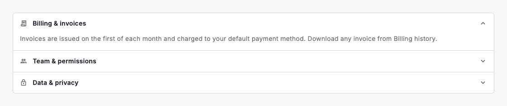
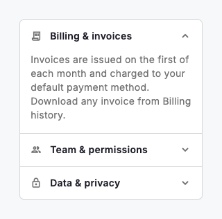

# Accordion

An accordion stacks a set of collapsible sections so a long or dense page collapses to a scannable list of headers, and people expand only the parts they care about. Build one with `DsAccordion` and a list of `DsAccordionItem`s — each pairs a single-line header (with an optional leading icon and an auto-rotating chevron) with a body that animates open and closed. By default the accordion is single-open: expanding one section collapses the rest, keeping focus on a single answer; set `allowMultiple: true` when sections are independent and people may want several open at once. Reach for it to tame FAQs, settings groups, and progressive detail — not to hide content people must not miss.

Set `initiallyExpanded: true` on the item people most likely need first so the accordion opens with useful content already visible. In single-open mode only the first such item stays open; the rest resolve closed. A collapsed body is removed from the tree entirely, so assistive technology never reads hidden content, and each header exposes its expanded state to screen readers.



*Desktop (1280dp)*



*Small phone (320dp)*

## Guidelines

**Do**

- Use an accordion to break long content into short, self-describing sections.
- Write header titles that summarise the section in one scannable line.
- Keep the default single-open mode when only one answer is relevant at a time.
- Set allowMultiple: true when sections are independent and often read together.
- Open the most important section with initiallyExpanded so the page is useful at a glance.
- Add a leading icon when it helps people recognise a section faster.

**Don't**

- Don't hide essential information or required actions inside a collapsed section.
- Don't nest accordions inside accordions — flatten the structure instead.
- Don't write header titles so long they ellipsize away their meaning.
- Don't use an accordion for a single section — a plain heading and body is clearer.

## Example

```dart
DsAccordion(
  allowMultiple: false,
  items: const [
    DsAccordionItem(
      title: 'Billing & invoices',
      leading: Icon(Icons.receipt_long_outlined),
      initiallyExpanded: true,
      child: Text(
        'Invoices are issued on the first of each month and charged to your '
        'default payment method. Download any invoice from Billing history.',
      ),
    ),
    DsAccordionItem(
      title: 'Team & permissions',
      leading: Icon(Icons.group_outlined),
      child: Text(
        'Owners and admins can invite teammates and assign roles. Members keep '
        'access until an admin removes them from the workspace.',
      ),
    ),
    DsAccordionItem(
      title: 'Data & privacy',
      leading: Icon(Icons.lock_outline),
      child: Text(
        'Your data is encrypted in transit and at rest. Export or delete your '
        'workspace at any time from Settings.',
      ),
    ),
  ],
);
```

## See also

- [Divider](divider.md)
- [list](list.md)
