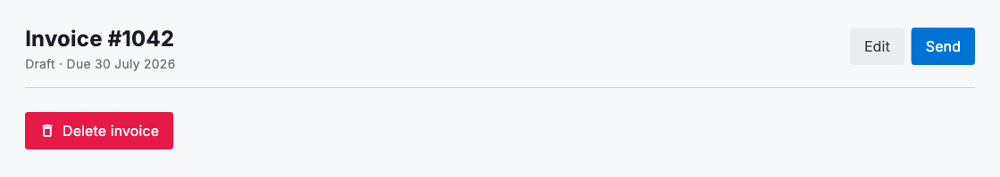
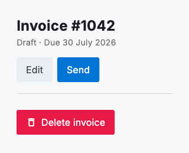

# Action buttons

Anchor a record's main actions in its `DsPageHeader` so they stay reachable while the content below scrolls. Give each view a single primary `DsButton` for the one action you most want people to take, and render the supporting choices as `secondary` buttons beside it. This consistent right-aligned placement means people always know where to look to act, and the emphasis in the button styling tells them which action is the expected next step.

Emphasis comes from the `variant`, not the position. Reserve the `danger` variant for destructive, hard-to-undo actions such as deleting a record or voiding a document, and pair it with a confirmation step. Ordinary actions — even important ones like saving — should never borrow the danger style, or the colour stops signalling real risk.



*Desktop (1280dp)*



*Small phone (320dp)*

## Guidelines

**Do**

- Put the main actions in the page header so they stay visible while content scrolls.
- Use exactly one primary button per view for the expected next step.
- Render supporting choices as secondary buttons beside the primary one.
- Keep action placement consistent across every page in the product.
- Reserve the danger variant for destructive, hard-to-undo actions.

**Don't**

- Don't bury actions at the bottom of scrolling content.
- Don't present two primary buttons competing for attention.
- Don't use the danger style for ordinary actions.
- Don't change action order or placement from one page to the next.

## Example

```dart
import 'package:design_system/design_system.dart';
import 'package:flutter/material.dart';

DsPageHeader(
  title: 'Invoice #1042',
  subtitle: 'Draft · Due 30 July 2026',
  actions: [
    DsButton(
      label: 'Edit',
      variant: DsButtonVariant.secondary,
      onPressed: () {},
    ),
    DsButton(label: 'Send', onPressed: () {}),
  ],
)
```

## See also

- [Full-page layouts](full-page-layouts.md)
- [Communicating state](communicating-state.md)
