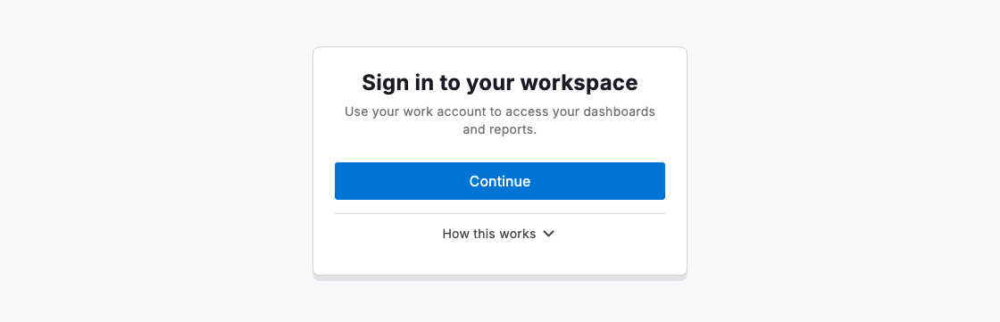
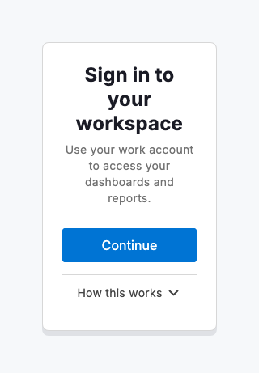

# Additional context

Some sign-in screens carry more than a single action: a note about what happens next, which account to use or why access is required. Rather than crowding the entry point with that detail, `DsSignInView` can tuck it behind a reveal. Pass `additionalContextLabel` and `additionalContext` to expose a small, on-demand explanation. The primary task stays front and centre, and people who want to read further can open it before they continue.

The reveal stays collapsed by default, so the first thing anyone sees is the title, a short description and the primary action. Expanding it surfaces supporting lines without navigating away or resetting the form. Keep the hidden content to a few short sentences or bullet rows; if the explanation grows into paragraphs or requires acknowledgement, move it to a separate screen instead.



*Desktop (1280dp)*



*Small phone (320dp)*

## Guidelines

**Do**

- Keep the sign-in screen focused on the single action people came to take.
- Put supplementary detail behind a reveal or a separate screen.
- Keep the revealed context brief: a few short lines or bullet rows.
- Use plain language that answers the question the reveal label implies.

**Don't**

- Don't overload the sign-in screen with paragraphs of explanation.
- Don't make the context mandatory reading before someone can continue.
- Don't hide anything essential to the action behind the reveal.

## Example

```dart
DsSignInView(
  title: 'Sign in to your workspace',
  description: 'Use your work account to access your dashboards and reports.',
  primaryAction: DsSignInAction(
    label: 'Continue',
    onPressed: () {},
  ),
  additionalContextLabel: 'How this works',
  additionalContext: Column(
    crossAxisAlignment: CrossAxisAlignment.start,
    children: const [
      Text('We verify your identity through your organisation\'s provider.'),
      SizedBox(height: 8),
      Text('Your permissions decide which records and settings you can see.'),
      SizedBox(height: 8),
      Text('You can switch workspaces at any time from your profile menu.'),
    ],
  ),
)
```

## See also

- [Onboarding](onboarding.md)
- [Sign in](sign-in.md)
