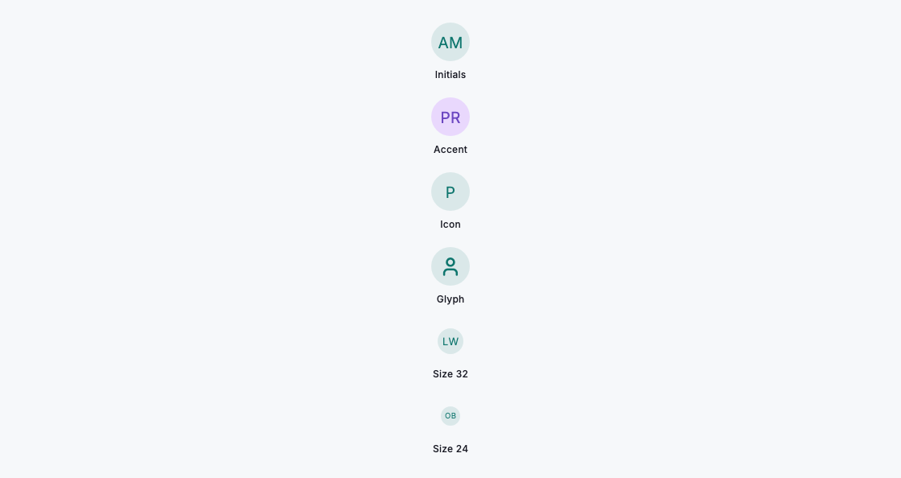
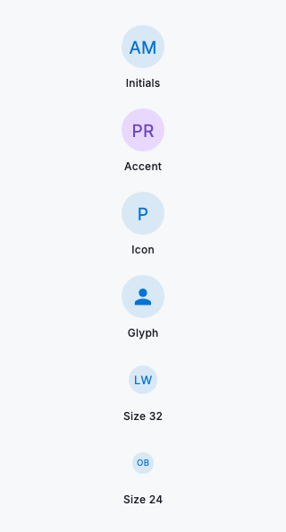

# Avatar

`DsAvatar` is a circular badge for a person or entity that is guaranteed to render something legible on the first frame. It resolves its content by priority: a network `imageUrl` when one loads, then up to two upper-cased initials derived from `name`, then a caller-supplied `icon` and finally a default person glyph. Because the image sits above that chain, an avatar shown while the picture is still loading (or when it fails, or when there is no network at all) falls straight back to initials instead of a broken-image icon, so lists and headers never flicker. The circle is `size` logical pixels across; the fill and foreground default to the active theme and adopt your white-label palette automatically, while `backgroundColor` and `foregroundColor` override them when you need a per-person accent. The whole widget is exposed to assistive technology as an image labelled by `name`, so screen readers announce who it represents.



*Desktop (1120dp)*



*Small phone (320dp)*

## Guidelines

**Do**

- Pass a `name` even when you have an `imageUrl`: it seeds the initials fallback and labels the avatar for screen readers.
- Set `size` to match the context: compact rows read well at 24 to 32, headers and profile cards at 48 and up.
- Let the theme drive colour by default so avatars stay consistent across the product; the initials stay legible at every size.
- Use `foregroundColor` and `backgroundColor` together to give a person or team a stable accent when you need to tell several apart.
- Use `icon` when the entity is not a person (a workspace, a bot or a service) and no name is available.
- Rely on the built-in fallback in lists and offline screenshots; the avatar renders initials rather than a broken image.

**Don't**

- Don't wrap `DsAvatar` in your own image error or loading handling; the load-then-fallback chain is built in.
- Don't leave both `name` and `imageUrl` null on a person; the avatar drops to a generic glyph and announces only "Avatar".
- Don't set an override colour so close to the fill that initials lose contrast; keep foreground and background clearly distinct.
- Don't stretch the avatar with an external `SizedBox`; it is always a circle of `size`. Change `size` instead.

## Example

```dart
// Loads the photo, falls back to "AM" initials until it does (or if it can't).
DsAvatar(
  imageUrl: 'https://cdn.example.com/people/amara-mensah.jpg',
  name: 'Amara Mensah',
  size: 48,
);

// Initials-only, with a per-person accent.
DsAvatar(
  name: 'Priya Raman',
  size: 40,
  backgroundColor: Color(0xFFE9D8FD),
  foregroundColor: Color(0xFF6B46C1),
);

// A non-person entity, using an icon fallback (no name, so the icon shows).
DsAvatar(
  icon: DsIcons.platform,
  size: 40,
);
```

## See also

- [Img](img.md)
- [Lists](lists.md)
