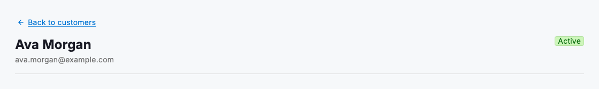
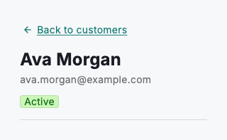

# Back link

A back link gives people a clear, labelled way to return to the screen they came from. Use `DsBackLink` at the top-left of a detail view: a single record, a report or a settings panel opened from a list. Pair a leading arrow with a label that names the destination, such as "Back to customers", so the return path is obvious before anyone clicks. Unlike the browser back button, an in-app back link is a deliberate, discoverable control that keeps navigation predictable no matter how the user reached the page.

Place the back link above the page title, aligned to the left edge of the content. Name the specific destination rather than using a generic "Back". The label doubles as a breadcrumb that reminds people where they are in the hierarchy and where a click will take them.



*Desktop (1120dp)*



*Small phone (320dp)*

## Guidelines

**Do**

- Name the destination, e.g. "Back to customers", not just "Back".
- Pair a leading arrow with the label so it reads as a return control.
- Place it at the top-left of a detail view, above the page title.
- Send people back to the exact screen they navigated from.

**Don't**

- Don't use a bare "Back" with no destination.
- Don't rely on the browser back button alone for in-app navigation.
- Don't bury the back link below the fold or centre it on the page.

## Example

```dart
DsBackLink(
  label: 'Back to customers',
  onPressed: () {},
);
```

## See also

- [Full-page layouts](full-page-layouts.md)
- [Action buttons](action-buttons.md)
