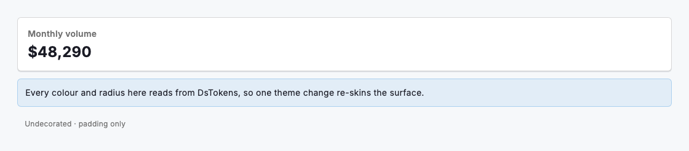
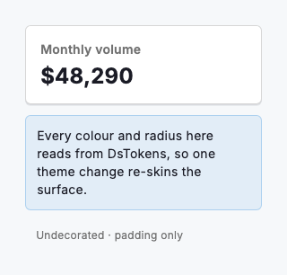

# Box

A box is the design system's primitive for wrapping a subtree in tokened spacing, a background, a border, a corner radius and elevation: everything you would otherwise hand-write on a raw `Container` and `BoxDecoration`. `DsBox` is deliberately colour-neutral: every colour defaults to `null`, so an undecorated box is as cheap as a `Padding`, and you opt into surface treatment by passing theme tokens read from `DsTokens.of(context)` (`colorBackground`, `colorBorder` and `borderRadius`) rather than literal hex. Use it to build cards, panels, callouts and inset regions whose padding and radius track the theme, so a single token change re-skins every surface at once.

Feed `DsBox` values from the theme rather than raw colours: pass `tokens.colorBackground` for the fill, `tokens.colorBorder` for the stroke, `tokens.borderRadius` for the corners and a `DsElevation` step such as `DsElevation.low` for the shadow. A box with no explicit `width` or `height` sizes to its child and collapses to a 320dp phone; supplying an `alignment` makes it expand to fill the available space, as `Container` does.



*Desktop (1280dp)*



*Small phone (320dp)*

## Guidelines

**Do**

- Read colours from `DsTokens.of(context)` (background, border and radius) instead of hard-coding hex values.
- Use `DsSpacing` steps for `padding` and `margin` so insets stay on the spacing scale.
- Pass a `DsElevation` step (low, medium, high) to `shadow` to lift a surface off the page.
- Let the box size to its child; add `width`/`height` only when a fixed footprint is required.
- Set `borderWidth` alongside `borderColor` when you need a heavier stroke than the 1px default.
- Use `DsBox` to build cards, panels and callouts instead of a raw `Container` + `BoxDecoration`.

**Don't**

- Don't hard-code hex colours; a box should re-skin when the theme tokens change.
- Don't nest many decorated boxes to fake elevation; use the `shadow` token instead.
- Don't rely on the box to clip an overflowing child unless you set a non-zero `borderRadius`.
- Don't set `borderWidth` without a `borderColor`; the width is ignored when no border is drawn.

## Example

```dart
final tokens = DsTokens.of(context);

DsBox(
  padding: const EdgeInsets.all(DsSpacing.lg),
  background: tokens.colorBackground,
  borderColor: tokens.colorBorder,
  borderRadius: tokens.borderRadius,
  shadow: DsElevation.low,
  child: const Text('Monthly volume'),
);
```

## See also

- [Divider](divider.md)
- [Form field group](form-field-group.md)
