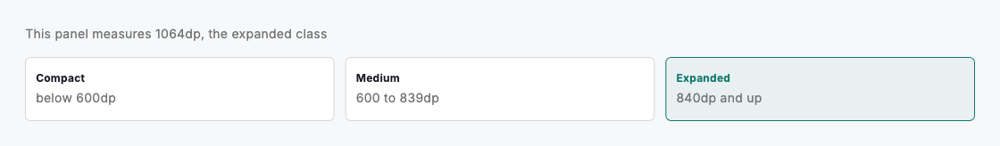
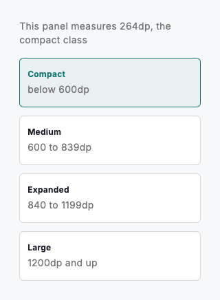

# Breakpoints & responsiveness

Layouts adapt to the width of the window, never the device. `DsBreakpoints` names the three Material 3 window classes (compact below 600dp, medium from 600dp, expanded from 840dp), so design and engineering share one vocabulary for where a layout changes. Most components go further and respond to their own measured width, which is how the same molecule works in a narrow card, a split pane and a full window without knowing which it is in.

Resolve the class for the window with `DsBreakpoints.of(context)`, or for any measured width with `DsBreakpoints.windowSizeFor`. Classes compare with `>=`, so "at least medium" reads as `DsBreakpoints.of(context) >= DsWindowSize.medium`. Reach for the window class only for a genuine window-level decision, such as what chrome the page carries. For everything inside the page, measure the component itself with a `LayoutBuilder` and a content threshold: `DsFormFieldGroup` stacks its fields when it measures narrower than its `minRowWidth` (360dp by default), and `DsPageHeader` moves its actions beneath the title below 600dp of its own width. That is why both adapt inside a split pane, where the window class alone would mislead.

## Boundaries

| Name | Type | Example value | Description |
| --- | --- | --- | --- |
| `DsBreakpoints.medium` | `double` | `600` | Lower bound of the medium window class. |
| `DsBreakpoints.expanded` | `double` | `840` | Lower bound of the expanded window class. |
| `DsBreakpoints.contentMaxWidth` | `double` | `960` | The cap on main content width on wide screens. DsPageScaffold applies it by default and centres the surplus. |

## Resolving a class

| Name | Type | Example value | Description |
| --- | --- | --- | --- |
| `DsBreakpoints.of(context)` | `DsWindowSize` | `expanded` | The class for the current window width. |
| `DsBreakpoints.windowSizeFor(width)` | `DsWindowSize` | `compact` | The class for any width, such as a LayoutBuilder constraint. |
| `DsWindowSize.compact` | `enum` | `below 600dp` | Phones in portrait. One column, stacked actions, full-width panels. |
| `DsWindowSize.medium` | `enum` | `600 to 839dp` | Tablets in portrait and large phones in landscape. |
| `DsWindowSize.expanded` | `enum` | `840dp and up` | Tablets in landscape and desktops. Constrain content and centre the surplus. |

The system is tested the way it is used: every component holds from a 320dp phone to a 1920dp desktop without overflow, and the docs sweep each live demo across eleven widths between those ends. Treat the boundaries as ranges, not targets; a layout must flex all the way through a class, not just at its edges. Honour the user's text scale too: text wraps or ellipsizes, it never clips.



*Desktop (1120dp)*



*Small phone (320dp)*

## Guidelines

**Do**

- Decide with the window class only at window level, such as what chrome a page carries; measure the component itself for everything inside.
- Compare classes with `>=`: `DsBreakpoints.of(context) >= DsWindowSize.medium` reads as "at least medium".
- Cap wide layouts at `DsBreakpoints.contentMaxWidth` and centre the surplus, as `DsPageScaffold` does by default.
- Prove a layout at 320dp and at 1920dp; the two ends break in different ways.

**Don't**

- Don't branch on the platform or device type; a desktop window can be narrow and a tablet wide. Width is the only truth.
- Don't hardcode 600 or 840; read the boundary from `DsBreakpoints` so every surface agrees on where layout changes.
- Don't hide content on compact windows; reflow it. A phone gets everything a desktop gets, stacked.
- Don't design only for the boundaries; the widths between them must still flex, wrap and never overflow.

## Example

```dart
import 'package:design_system/design_system.dart';
import 'package:flutter/material.dart';

// A genuine window-class decision: what chrome the page carries.
final atLeastMedium = DsBreakpoints.of(context) >= DsWindowSize.medium;

// Everything else responds to its own width, not the window's.
LayoutBuilder(
  builder: (context, constraints) {
    final stacked = constraints.maxWidth < DsBreakpoints.medium;
    return Flex(
      direction: stacked ? Axis.vertical : Axis.horizontal,
      children: const [
        // …
      ],
    );
  },
);
```

## See also

- [Design tokens](design-tokens.md)
- [Form field group](form-field-group.md)
- [Full-page layouts](full-page-layouts.md)
