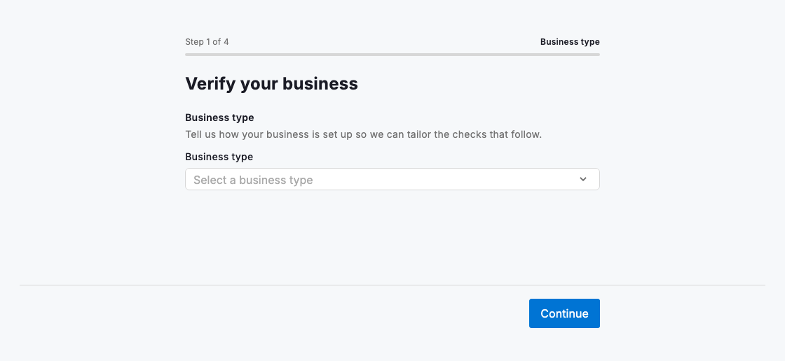
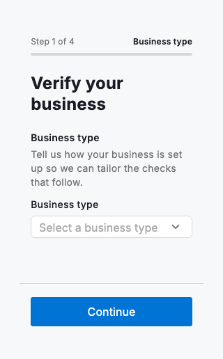

# Business verification

Business verification collects the facts you need to confirm an organisation and the person acting for it, split across four short, ordered steps: business type, business details, representative identity, then a review before submitting. `DsBusinessVerification` composes existing building blocks. The progress stepper, title and Back / Continue actions come from `DsOnboardingWizard`, and each step body is assembled from `DsFormFieldGroup`, `DsSelect`, `DsTextField` and `DsCheckbox`, so it stays visually consistent with the rest of your forms. It owns every entered value in local state, so moving back never loses input and the review step always reads back the latest answers. Advancing past the identity step is gated on an authorisation consent checkbox, and submitting swaps the flow for a static success confirmation and fires `onSubmitted`.



*Desktop (1280dp)*



*Small phone (320dp)*

## Guidelines

**Do**

- Order steps from least to most sensitive: classify the business first, then details, then who is completing the check.
- Ask the user to enter names and numbers exactly as they appear on official registration so the values are verifiable.
- Gate the identity step on the authorisation checkbox so only someone confirming they can act for the business proceeds.
- Keep the review step honest: read back every entered value, including a clear "Not confirmed" when consent is missing.
- Give the flow a bounded height (the wizard fills the space it is given and scrolls its body when room is tight).
- Wire `onSubmitted` to your backend submission and `onCancel` to dismiss the flow from its first step.

**Don't**

- Don't ask for information you will not verify; every extra field slows the user and lowers completion.
- Don't let users submit before the authorisation consent is ticked; the identity step blocks advancing until it is.
- Don't rebuild the fields, stepper or action bar by hand; compose the flow so it inherits Design System behaviour.
- Don't place the flow in an unbounded-height parent; the wizard body is an `Expanded` scroll view and needs a bounded height.

## Example

```dart
DsBusinessVerification(
  onSubmitted: () {
    // Persist the collected details and advance your app.
    _submitVerification();
  },
  onCancel: () {
    // Backing out of the first step dismisses the flow.
    Navigator.of(context).maybePop();
  },
);
```

## See also

- [Onboarding wizard](onboarding-wizard.md)
- [Sign up](sign-up.md)
