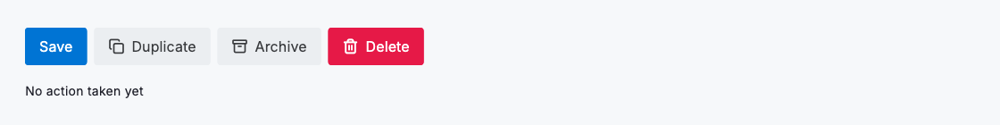
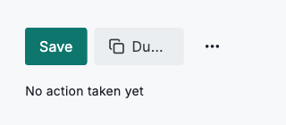

# Button group

`DsButtonGroup` is the toolbar primitive for a set of related actions. Hand it a list of `children` (usually `DsButton`s in priority order) and it keeps them on a single line, measuring the width the parent gives it and collapsing whatever will not fit into a trailing "More" menu. The leading actions stay inline the longest and trailing ones are the first to move into the menu, so the same group shows every action on a wide desktop and just one or two plus a menu on a 320dp phone, with no breakpoint configuration. Because each collapsed `DsButton` carries its own label, icon and `onPressed` into the menu entry, an action behaves identically whether it is shown inline or overflowed, and the row is guaranteed never to clip or wrap.



*Desktop (1120dp)*



*Small phone (320dp)*

## Guidelines

**Do**

- Order children by importance: the most important action first, since trailing ones overflow first.
- Fill the group with `DsButton`s so collapsed actions keep their label, icon and callback in the menu.
- Let width decide how many actions show inline; the group is responsive without breakpoints.
- Use `maxVisible` to cap inline actions when you want a menu even where the width would allow more.
- Use a button group whenever a toolbar or row of record actions must survive narrow layouts.

**Don't**

- Don't wrap the group in an unbounded-width row or scroll view; it needs real constraints to measure against.
- Don't hand-roll your own overflow logic or a `Wrap` when the actions belong on one line.
- Don't put the primary action last where it is the first to be hidden in the menu.
- Don't mix in non-`DsButton` children for key actions; they overflow under a generic "Action N" label.

## Example

```dart
import 'package:design_system/design_system.dart';
import 'package:flutter/material.dart';

DsButtonGroup(
  children: [
    DsButton(label: 'Save', onPressed: _save),
    DsButton(
      label: 'Duplicate',
      variant: DsButtonVariant.secondary,
      icon: DsIcons.copy,
      onPressed: _duplicate,
    ),
    DsButton(
      label: 'Archive',
      variant: DsButtonVariant.secondary,
      icon: DsIcons.archive,
      onPressed: _archive,
    ),
    DsButton(
      label: 'Delete',
      variant: DsButtonVariant.danger,
      icon: DsIcons.delete,
      onPressed: _delete,
    ),
  ],
)
```

## See also

- [Action buttons](action-buttons.md)
- [Menu](menu.md)
