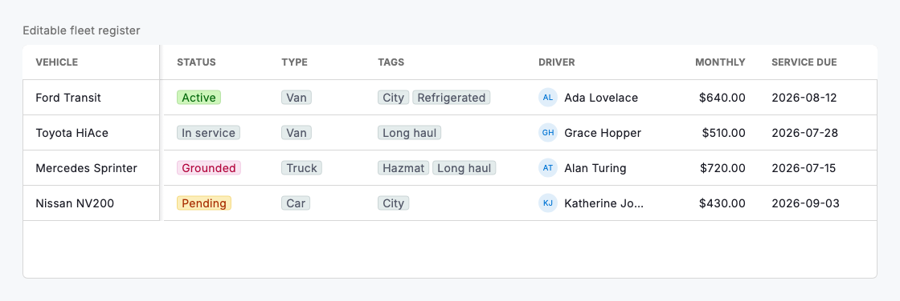
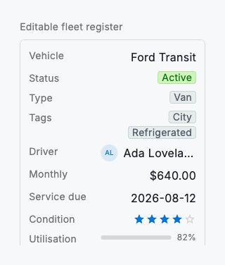

# Cell types & editing

Every column in a `DsDataGrid` declares a `DsCellType`, and that one choice decides three things at once: how the value is rendered, how it sorts and aligns and, when editing is on, how it is edited. Text, number and currency render as aligned type; `status`, `singleSelect` and `multiSelect` render as coloured badges drawn from the column's `options`; `user` shows an avatar and name; `date` a formatted day; `rating` a five-star row; `checkbox` a tick; `progress` an inline bar; and `link` an actionable label. You describe the shape of your data once and the grid renders it consistently everywhere.

Editing is opt-in and controlled. Set `DsDataGrid.editable` and mark the editable columns with `editable: true`; the grid then opens the right editor for each type when a cell is tapped: an inline text field for text, number, currency, link and user; the platform date picker for dates; an option menu for single-select and status; a checkable panel for multi-select; an immediate toggle for checkboxes; and a tap-to-set row for ratings. Progress is always read-only. The text-style editors commit on Enter or focus loss and cancel on Escape, while the pickers, menus and toggles commit on selection. The grid never mutates your rows: it reports the new value through `onCellChanged(rowId, columnKey, value)` so your state stays the single source of truth.

Because the value type drives everything, keep each cell's runtime type honest: a `num` for number and currency, a `DateTime` for date, a `bool` for checkbox, an `int` 0 to 5 for rating, a `double` 0 to 1 for progress, a `String` option value for select and status, and a `List<String>` for multi-select. A value that does not match its column renders as an em dash rather than throwing, so partial or mid-import data still displays cleanly.



*Desktop (1120dp)*



*Small phone (320dp)*

## Guidelines

**Do**

- Give every select, status and multi-select column an `options` list so its labels and colours are consistent and its editor can offer the choices.
- Store the stable option `value` in the cell and let the option supply the human-readable `label`; renaming a label then never touches your data.
- Match each cell's runtime type to its `DsCellType`; mistyped values fall back to an em dash instead of the intended cell.
- Treat the grid as controlled: apply `onCellChanged` to your own state and pass the updated rows back so edits and other views stay in sync.
- Leave computed or derived columns (like `progress`) non-editable so people don't try to hand-edit a value the system owns.

**Don't**

- Don't build a parallel set of ad-hoc cell widgets; use the built-in types so sorting, alignment and editing stay coherent across the grid.
- Don't put free text where a select belongs; options keep values clean and make the data filterable and groupable later.
- Don't mutate rows inside the grid and also in `onCellChanged`; pick one source of truth (your state) to avoid flicker and lost edits.
- Don't make a column editable when the value is derived or read-only upstream; it invites edits that cannot be saved.

## Example

```dart
DsDataGrid(
  editable: true,
  onCellChanged: (rowId, columnKey, value) {
    setState(() => _apply(rowId, columnKey, value));
  },
  columns: const [
    DsGridColumn(key: 'vehicle', title: 'Vehicle', frozen: true, editable: true),
    DsGridColumn(
      key: 'status',
      title: 'Status',
      type: DsCellType.status,
      editable: true,
      options: [
        DsGridOption(value: 'active', label: 'Active', variant: DsBadgeVariant.success),
        DsGridOption(value: 'grounded', label: 'Grounded', variant: DsBadgeVariant.danger),
      ],
    ),
    DsGridColumn(
      key: 'monthly',
      title: 'Monthly',
      type: DsCellType.currency,
      currencySymbol: r'$',
      editable: true,
    ),
    DsGridColumn(key: 'serviceDue', title: 'Service due', type: DsCellType.date, editable: true),
    DsGridColumn(key: 'condition', title: 'Condition', type: DsCellType.rating, editable: true),
    DsGridColumn(key: 'utilisation', title: 'Utilisation', type: DsCellType.progress), // read-only
    DsGridColumn(key: 'insured', title: 'Insured', type: DsCellType.checkbox, editable: true),
  ],
  rows: _rows,
);
```

## See also

- [Data grid](data-grid.md)
