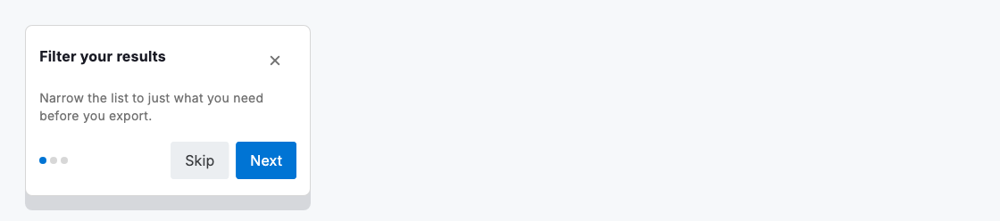
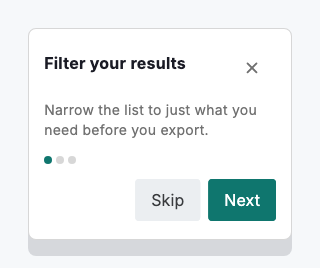

# Coachmark

A coachmark is a compact spotlight callout that points a first-time person at exactly one thing and nudges them through a short guided sequence. Built with `DsCoachmark`, it is an elevated card (capped at roughly 320dp) carrying a title, optional supporting body, an optional row of progress dots (`stepIndex` of `stepCount`) and up to two actions: a primary for the forward move ("Next", "Got it") and a secondary for the escape hatch ("Skip", "Back"). It renders the card only. It neither positions itself over a target nor draws a spotlight, so you place it inside your own overlay or popover. Because it starts no timers and runs no animation, it is safe to capture the moment it is built.

Use a coachmark when a feature is genuinely new or easy to miss, and only when a single, well-placed hint will do. Keep each step to one idea and one action; if you find yourself explaining several things at once, the feature likely needs a clearer design rather than a longer tour. Provide `onDismiss` so people can leave at any point, and always let a tour end with a persistent way back to the same information.



*Desktop (1120dp)*



*Small phone (320dp)*

## Guidelines

**Do**

- Point each coachmark at exactly one target and describe one action.
- Use the primary action for the forward move and the secondary for the escape hatch.
- Show progress dots for a multi-step tour so people know how far they have to go.
- Always offer a way out: provide onDismiss and a Skip action on longer tours.
- Keep the title short and let the body carry the one supporting sentence.
- Position the card near its target inside your own overlay, clear of what it describes.

**Don't**

- Don't stack several coachmarks on screen at once or explain multiple features in one card.
- Don't trap people in a tour; never ship a step without a dismiss or skip path.
- Don't use a coachmark for errors, confirmations or long-form help.
- Don't rely on it to appear over a target on its own; it renders the card, you handle placement.

## Example

```dart
DsCoachmark(
  title: 'Filter your results',
  body: 'Narrow the list to just what you need before you export.',
  stepIndex: 0,
  stepCount: 3,
  primaryActionLabel: 'Next',
  onPrimary: _goToNextStep,
  secondaryActionLabel: 'Skip',
  onSecondary: _dismissTour,
  onDismiss: _dismissTour,
);
```

## See also

- [Onboarding](onboarding.md)
- [Onboarding wizard](onboarding-wizard.md)
