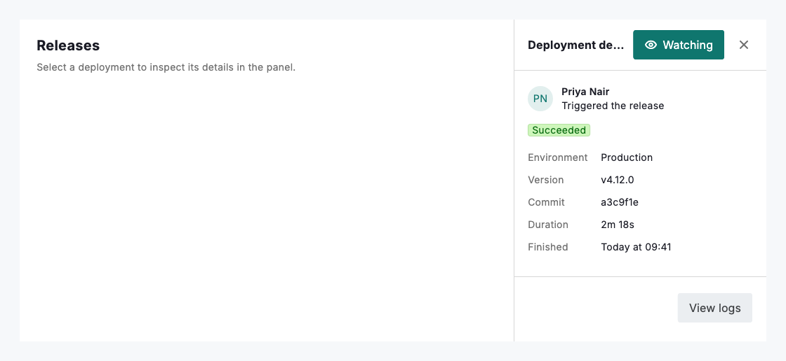
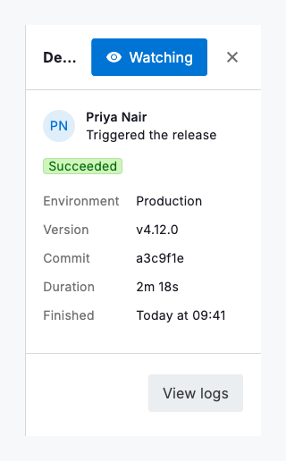

# Context view

A context view is an embedded, non-modal panel pinned to the edge of a layout that supplements the primary content without taking it over. Use `DsContextView` when a person needs supporting detail (an inspector, a filter column, a live preview or a help panel) kept in view while they keep working alongside it. It gives you a titled header with optional actions and a close button, a scrollable body and an optional footer set off by a divider, all drawn from the same design tokens as the surrounding app. On wide layouts the panel sits at a fixed `width` beside the main column; on narrow layouts it expands to fill the available width, so it never overflows down to a 320dp viewport.

Unlike a modal drawer, a context view is always part of the layout: it does not dim the page or block interaction with what sits beside it. Because it starts no timers or animations, it renders a stable frame and keeps state (scroll position, selection, form entries) intact while the main content changes around it. Provide `onClose` only when the panel is genuinely dismissible; without it the header shows no close button and the panel reads as a permanent part of the workspace.



*Desktop (1120dp)*



*Small phone (320dp)*

## Guidelines

**Do**

- Use it for supporting detail that should stay visible while someone works in the primary column.
- Keep the header title short; it truncates with an ellipsis when space is tight.
- Put the panel's primary action in the footer so it stays reachable below a scrolling body.
- Reserve header actions for a couple of compact controls, such as a secondary or icon button.
- Provide onClose only when the panel is genuinely dismissible; omit it for a permanent column.
- Let the panel fill the width on narrow layouts rather than forcing a fixed width.

**Don't**

- Don't use it for content that must interrupt the task; use a modal or a focus view instead.
- Don't crowd the header with more than a couple of actions; move the rest into the body or footer.
- Don't rely on a fixed pixel width at phone sizes; the panel is designed to expand to fill.
- Don't hide the primary action inside a long scrolling body when it belongs in the footer.

## Example

```dart
Row(
  children: [
    const Expanded(child: MainContent()),
    DsContextView(
      title: 'Details',
      onClose: () => setState(() => _showPanel = false),
      actions: const [
        DsButton(label: 'Edit', variant: DsButtonVariant.secondary),
      ],
      footer: DsButton(label: 'Save changes', onPressed: _save),
      child: Column(
        crossAxisAlignment: CrossAxisAlignment.start,
        children: const [
          DsBadge(label: 'Active', variant: DsBadgeVariant.success),
          SizedBox(height: 16),
          Text('Supporting detail that stays beside the main content.'),
        ],
      ),
    ),
  ],
)
```

## See also

- [Settings view](settings-view.md)
- [Focus view](focus-view.md)
