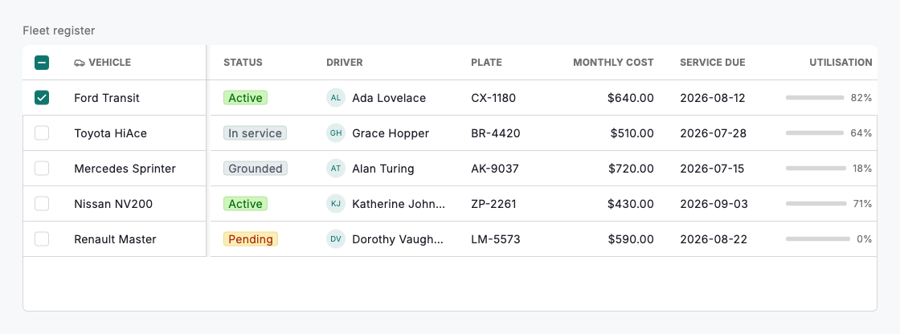
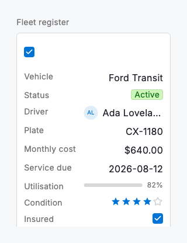

# Data grid

`DsDataGrid` is the spreadsheet-grade table at the centre of the data experience — a dense, scrollable grid of typed cells for working through hundreds of records at a glance. Each column declares a `DsCellType`, so the grid renders a status as a coloured badge, a person as an avatar and name, an amount as aligned currency, a ratio as an inline progress bar, and so on, without you hand-building any cell. The leading column can be frozen so a record stays identifiable while the rest scrolls sideways; headers sort on tap; rows select with a tri-state select-all; and columns resize by dragging their trailing edge. Below `compactBreakpoint` the whole grid re-flows into stacked cards, so the same data reads cleanly from a 320dp phone up to a wall-width desktop.

The grid is deliberately unopinionated about where its data comes from or how it is mutated: give it a list of `DsGridColumn`s and a list of `DsGridRow`s and it renders. Sort and selection can be left to the grid (uncontrolled) or driven from your own state by supplying `sort` / `onSort` and `selectedRowIds` / `onSelectionChanged` — the same widget backs a quick read-only table and a fully controlled, server-sorted dataset. Values whose runtime type does not match the column render as an em dash rather than throwing, so a sparse or in-progress import still displays.

Reach for the data grid when the job is scanning and comparing many records across many attributes. When a person needs to see one record in full, pair it with a record panel; when they need to slice the set, layer a filter bar and grouping above it. The grid is the surface those patterns build on.



*Desktop (1280dp)*



*Small phone (320dp)*

## Guidelines

**Do**

- Freeze the column that identifies the record (a name, a plate, an id) so it stays visible while the rest scrolls sideways.
- Match each column's `type` to its data so cells sort correctly and align by convention — numbers, currency and progress to the trailing edge.
- Let the grid own sort and selection for simple tables; lift them to `onSort` and `onSelectionChanged` only when your data source needs to react.
- Give the grid a `caption` — it renders as a heading above the table and is exposed to assistive technology as one, introducing the grid in reading order.
- Keep column widths honest: set a realistic `width` and a `minWidth` that still shows the value, and let dense columns resize.

**Don't**

- Don't pour a single record's detail into an ever-wider row — send people to a record panel instead of forcing horizontal scrolling through everything.
- Don't freeze several columns; one identifying column keeps the seam legible, more just eats the scrollable width.
- Don't disable the compact card layout to keep a wide grid on a phone — the stacked cards are how the data stays readable there.
- Don't put actions that mutate data behind a row tap alone; make them explicit so they are reachable by keyboard and screen reader.

## Example

```dart
DsDataGrid(
  caption: 'Fleet register',
  selectable: true,
  columns: const [
    DsGridColumn(key: 'vehicle', title: 'Vehicle', frozen: true, width: 180),
    DsGridColumn(key: 'status', title: 'Status', type: DsCellType.status),
    DsGridColumn(key: 'driver', title: 'Driver', type: DsCellType.user),
    DsGridColumn(
      key: 'monthly',
      title: 'Monthly cost',
      type: DsCellType.currency,
      currencySymbol: r'$',
    ),
    DsGridColumn(key: 'serviceDue', title: 'Service due', type: DsCellType.date),
    DsGridColumn(key: 'utilisation', title: 'Utilisation', type: DsCellType.progress),
    DsGridColumn(key: 'insured', title: 'Insured', type: DsCellType.checkbox),
  ],
  rows: [
    DsGridRow(id: 'v1', cells: {
      'vehicle': 'Ford Transit',
      'status': 'Active',
      'driver': 'Ada Lovelace',
      'monthly': 640,
      'serviceDue': DateTime(2026, 8, 12),
      'utilisation': 0.82,
      'insured': true,
    }),
    // …more rows
  ],
  onSelectionChanged: (ids) => print('selected $ids'),
  onSort: (sort) => print('sort by ${sort?.columnKey}'),
);
```

## See also

- [Lists](lists.md)
- [Filter controls](filter-controls.md)
