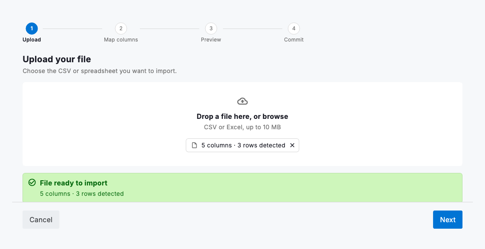
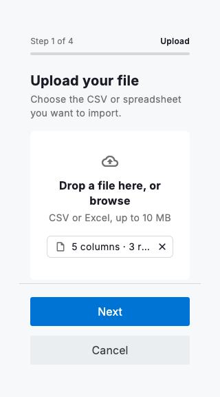

# Data import

`DsImportWizard` is the four-step flow for getting a spreadsheet of records into the system the way people expect from Airtable or HubSpot: upload a file, map its columns onto your fields, preview and fix what does not fit, then commit. It leans on the pieces you already have — a `DsProgressStepper` for the steps, a `DsDropzone` for the upload, a `DsSelect` per field for the mapping, and a read-only `DsDataGrid` for the preview — so an import looks and behaves like the rest of the data surfaces rather than a bolted-on modal.

The wizard is deliberately IO-free: it never touches the filesystem. Your app parses the chosen file however it likes and hands the wizard an `ImportSource` — a list of header names and rows of raw string cells — and the wizard takes it from there. It auto-matches each destination column to a source header by name, lets a person correct the mapping or skip a column, then coerces every mapped cell to the destination `DsCellType`: numbers and currency to a number, dates to a `DateTime`, checkboxes to a bool, everything else to text. A cell that cannot coerce, or a required cell left empty, is flagged as an error; the preview counts the errors and excludes those rows, and only the clean, coerced `DsGridRow`s are handed back through `onCommit`.

Because the destination is an ordinary list of `DsGridColumn`s and the output is ordinary `DsGridRow`s, an import lands in exactly the shape the grid, board and record panel already speak — there is no separate import data model to reconcile. Keep the person in control at the preview step: show them what will and will not import before anything is written.



*Desktop (1280dp)*



*Small phone (320dp)*

## Guidelines

**Do**

- Parse the file in your app and pass a clean `ImportSource`; let the wizard own mapping, coercion and validation.
- Name your destination columns like the headers people export, so the auto-match lands most of the mapping for them.
- Make the preview honest — show the error count and which rows will be skipped before the commit, not after.
- Coerce to the column type so imported records behave exactly like typed-in ones in the grid, filters and policies.

**Don't**

- Don't do file IO inside the wizard or the dropzone; they are presentation, and the app owns reading and parsing the file.
- Don't silently drop bad rows — surface the error count so people can fix the source and re-import with confidence.
- Don't force a person past a mapping they have not checked; the map step is where a good import is won or lost.
- Don't invent a bespoke import record type; commit `DsGridRow`s so the data flows straight into the rest of the system.

## Example

```dart
DsImportWizard(
  destinationColumns: columns,   // the fields to import into
  // Your app parsed the file into headers + raw rows:
  source: const ImportSource(
    headers: ['Vehicle', 'Status', 'Plate', 'Monthly cost', 'Service due'],
    rows: [
      ['Ford Transit', 'active', 'CX-1180', '640', '2026-08-12'],
      // …more rows
    ],
  ),
  onBrowse: _pickAndParseFile,   // asked to load a file at step 1
  onCancel: () => Navigator.of(context).maybePop(),
  onCommit: (rows) => _insertAll(rows),  // clean, coerced DsGridRows
);
```

## See also

- [Data grid](data-grid.md)
- [Record panel](record-panel.md)
- [Cell types & editing](cell-types.md)
