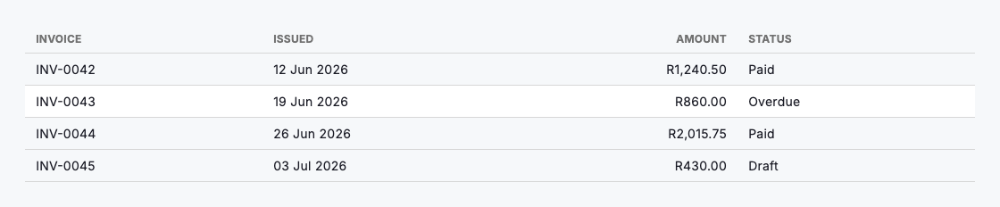
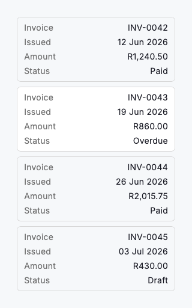

# Data table

`DsDataTable` displays a handful of rows that are already formatted. Cells are plain strings, there is nothing to configure, and the layout adapts on its own: a true tabular grid with a header row and right-aligned numeric columns on a wide window, and one bordered "label: value" card per row below `compactBreakpoint`, so a 320dp phone never overflows or scrolls sideways. Rows can carry their own `onTap` and `selected` state.

Use it for a summary block inside a larger page — a few line items under a filter bar, an invoice breakdown, a comparison of plans. The point of the component is that it costs nothing to reach for: give it column labels and lists of strings and it renders, correctly, at every width.

It is not a lighter mode of `DsDataGrid`, and the grid is not a richer mode of it — they answer different questions. Reach for the grid the moment the table *is* the task rather than an illustration of it: sorting, selection, frozen columns, grouping, inline editing, keyboard navigation, a calculations footer. Moving between them is a rewrite of the data, not of the layout — strings become a `Map` keyed by column, and each column declares a `DsCellType`. Formatting is yours here: the table prints exactly the strings you hand it, so format currency, dates and numbers before they arrive.



*Desktop (1120dp)*



*Small phone (320dp)*

## Guidelines

**Do**

- Use it to display rows that are already formatted and need no interaction beyond a tap.
- Mark amount and count columns `numeric: true` so they align to the trailing edge by convention.
- Format currency, dates and numbers before passing them in — the table prints the strings it is given.
- Give every row the same number of cells as there are columns.
- Move to a `DsDataGrid` as soon as people need to sort, select or edit.

**Don't**

- Don't reach for it when the table is the task; that is the data grid's job.
- Don't hand-build a sort or a selection column on top of it.
- Don't pour dozens of columns into it — it has no frozen column to keep a row identifiable while the rest scrolls.
- Don't raise `compactBreakpoint` to keep a wide table on a phone; the stacked cards are how the data stays readable there.

## Example

```dart
import 'package:design_system/design_system.dart';
import 'package:flutter/material.dart';

DsDataTable(
  columns: const [
    DsColumn(label: 'Invoice'),
    DsColumn(label: 'Issued'),
    DsColumn(label: 'Amount', numeric: true),
    DsColumn(label: 'Status'),
  ],
  rows: [
    DsDataRow(
      cells: const ['INV-0042', '12 Jun 2026', 'R1,240.50', 'Paid'],
      onTap: () {},
    ),
    DsDataRow(
      cells: const ['INV-0043', '19 Jun 2026', 'R860.00', 'Overdue'],
      selected: true,
      onTap: () {},
    ),
  ],
)
```

## See also

- [Data grid](data-grid.md)
- [Table workbench](table-workbench.md)
- [Lists](lists.md)
