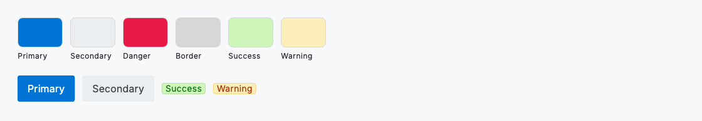
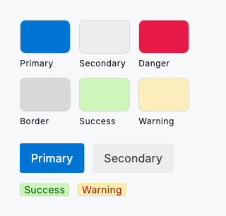

# Design tokens & theming

A token is a named value the whole library reads from, one for every colour, size, radius and font. Components never hard-code how they look; they ask the active theme. So you can re-brand the entire system in one place by passing your own tokens to `DsTheme.light` or `DsTheme.dark`. Out of the box it is white-label: neutral, and ready for your brand.

Read a token for the current theme with `DsTokens.of(context)`, then use it like any other value. Swap `DsTheme.light()` for `DsTheme.dark()` and every component changes at once. Sizes are plain numbers in logical pixels. Text is left as it is written unless you set it to uppercase, lowercase or capitalised.

Type comes in levels. Each heading, body and label level is a `DsTypeToken` that bundles its size, weight, line height and letter spacing, so you can restyle a whole level in one line: `copyWith(headingXl: DsTypeToken(fontSize: 30, fontWeight: DsTypography.bold))`. Button and badge labels are the exception: their size, weight and transform are separate tokens you set on their own.

## Commonly used variables

### Global

| Name | Type | Example value | Description |
| --- | --- | --- | --- |
| `fontFamily` | `String` | `Inter` | The font family used across every component. |
| `fontSizeBase` | `double` | `16` | The base font size, in logical pixels, that body text derives from. |
| `spacingUnit` | `double` | `8` | The base spacing unit, in logical pixels, that layout spacing derives from. |
| `borderRadius` | `double` | `6` | The general border radius used as the default for components. |
| `colorPrimary` | `Color` | `#0F766E` | The primary brand colour used for primary actions and accents. |
| `colorBrandSecondary` | `Color` | `#0F766E` | The brand's second mark, for a brand that runs two colours rather than one: the accent that carries a promotional call to action or a brand-owned highlight, distinct from colorPrimary and from the colorDanger signal even when both happen to be red. Defaults to colorPrimary, so the neutral base stays a single-brand system. |
| `colorBrandSecondaryTint` | `Color` | `#E6F5F2` | A soft wash of colorBrandSecondary: the quiet surface behind a secondary-brand badge or banner, the counterpart to brandTintColor for the second mark. Defaults to brandTintColor. |
| `colorBackground` | `Color` | `#FFFFFF` | The background colour for components, including overlays and surfaces. |
| `colorText` | `Color` | `#1A1B25` | The colour used for primary text. |
| `colorDanger` | `Color` | `#E61947` | The colour used to indicate errors or destructive actions. |
| `colorSuccess` | `Color` | `#05690D` | The bright signal colour for positive live status, such as a strength meter's good tier. Defaults to the success badge text colour. |
| `colorWarning` | `Color` | `#A82C00` | The bright signal colour for cautionary live status, such as a strength meter's fair tier. Defaults to the warning badge text colour. |

### Actions and buttons

| Name | Type | Example value | Description |
| --- | --- | --- | --- |
| `actionPrimaryColorText` | `Color` | `#0F766E` | The colour used for primary actions and links. |
| `actionSecondaryColorText` | `Color` | `#444444` | The colour used for secondary actions and links. |
| `buttonPrimaryColorBackground` | `Color` | `#0F766E` | The colour used as a background for primary buttons. |
| `buttonPrimaryGradient` | `List<Color>` | `[]` | The colour stops of a gradient fill for the primary button, painted instead of buttonPrimaryColorBackground and running from the top-left to the bottom-right corner. Empty by default, so the button stays a flat fill until a skin supplies stops. Only the resting and pending fills take them: a disabled button keeps its solid tint, because a gradient reads as available. Every stop has to clear AA against buttonPrimaryColorText, since the label crosses all of them. |
| `buttonPrimaryColorBorder` | `Color` | `#0F766E` | The border colour used for primary buttons. |
| `buttonPrimaryColorText` | `Color` | `#FFFFFF` | The text colour used for primary buttons. |
| `buttonPrimaryDisabledColorBackground` | `Color` | `#800F766E` | The background colour for disabled primary buttons (ARGB). Defaults to the primary background at 50% opacity; a skin can supply a solid tint instead. |
| `buttonPrimaryDisabledColorText` | `Color` | `#E6FFFFFF` | The text colour for disabled primary buttons (ARGB). Defaults to the primary text colour at 90% opacity. |
| `buttonSecondaryColorBackground` | `Color` | `#EBEEF1` | The colour used as a background for secondary buttons. |
| `buttonSecondaryColorBorder` | `Color` | `#EBEEF1` | The colour used as a border for secondary buttons. |
| `buttonSecondaryColorText` | `Color` | `#393B3E` | The text colour used for secondary buttons. |
| `buttonDangerColorBackground` | `Color` | `#E61947` | The background colour for danger buttons that indicate destructive actions. |
| `buttonDangerColorBorder` | `Color` | `#E61947` | The border colour for danger buttons that indicate destructive actions. |
| `buttonDangerColorText` | `Color` | `#FFFFFF` | The text colour for danger buttons that indicate destructive actions. |
| `buttonNeutralColorBackground` | `Color` | `#EBEEF1` | The colour used as a background for neutral buttons, which carry third-party or utility actions such as federated sign-in. Defaults to the secondary button background. |
| `buttonNeutralColorBorder` | `Color` | `#EBEEF1` | The border colour used for neutral buttons. Defaults to the secondary button border. |
| `buttonNeutralColorText` | `Color` | `#393B3E` | The text colour used for neutral buttons. Defaults to the secondary button text colour. |
| `buttonTertiaryColorBackground` | `Color` | `transparent` | The background colour for tertiary (text) buttons. Transparent by default, so the label alone carries the action. |
| `buttonTertiaryColorBorder` | `Color` | `transparent` | The border colour for tertiary (text) buttons. Transparent by default. |
| `buttonTertiaryColorText` | `Color` | `#0F766E` | The text colour for tertiary (text) buttons. Defaults to the primary action colour. |

### Text and surfaces

| Name | Type | Example value | Description |
| --- | --- | --- | --- |
| `colorSecondaryText` | `Color` | `#717171` | The colour used for secondary text. |
| `colorTextMuted` | `Color` | `#717171` | The quiet text tier beneath colorSecondaryText: a timestamp, a unit suffix, a caption that supports the line above it. Dimmer than colorSecondaryText but not the disabled treatment, so it still reads as live text. Defaults to colorIconMuted, the matching tier for glyphs. Reserve it for short supporting runs, never for a paragraph. |
| `colorBorder` | `Color` | `#D7D7D7` | The colour used for borders throughout components. |
| `colorBorderSubtle` | `Color` | `#D7D7D7` | The hairline tier beneath colorBorder: the quietest rule the system draws, used by dividers and decorative hairlines. Defaults to the border colour. |
| `formBackgroundColor` | `Color` | `#FFFFFF` | The background colour used for form items. |
| `offsetBackgroundColor` | `Color` | `#FFFFFF` | The background colour used when highlighting information, like the selected row on a table. |
| `colorSurfaceMuted` | `Color` | `#F6F8FA` | The muted surface tier: the quiet grey behind code wells, table headers and other recessed panels. Exposed to the Material scheme as surfaceContainerHighest. |
| `formHighlightColorBorder` | `Color` | `#D7D7D7` | The colour used to highlight form items when focused. |
| `formAccentColor` | `Color` | `#0F766E` | The colour used to fill form items such as tickboxes, radio buttons and switches. |
| `formPlaceholderTextColor` | `Color` | `#767676` | The colour for placeholder text in form items. |

### Typography

| Name | Type | Example value | Description |
| --- | --- | --- | --- |
| `headingXlFontSize` | `double` | `28` | The font size for the extra large heading typography. |
| `headingXlFontWeight` | `FontWeight` | `700` | The font weight for the extra large heading typography. |
| `headingXlTextTransform` | `DsTextTransform` | `none` | The text transform for the extra large heading typography. |
| `headingLgFontSize` | `double` | `24` | The font size for the large heading typography. |
| `headingLgFontWeight` | `FontWeight` | `700` | The font weight for the large heading typography. |
| `headingLgTextTransform` | `DsTextTransform` | `none` | The text transform for the large heading typography. |
| `headingMdFontSize` | `double` | `20` | The font size for the medium heading typography. |
| `headingMdFontWeight` | `FontWeight` | `700` | The font weight for the medium heading typography. |
| `headingMdTextTransform` | `DsTextTransform` | `none` | The text transform for the medium heading typography. |
| `headingSmFontSize` | `double` | `16` | The font size for the small heading typography. |
| `headingSmFontWeight` | `FontWeight` | `700` | The font weight for the small heading typography. |
| `headingSmTextTransform` | `DsTextTransform` | `none` | The text transform for the small heading typography. |
| `headingXsFontSize` | `double` | `12` | The font size for the extra small heading typography. |
| `headingXsFontWeight` | `FontWeight` | `700` | The font weight for the extra small heading typography. |
| `headingXsTextTransform` | `DsTextTransform` | `none` | The text transform for the extra small heading typography. |
| `bodyMdFontSize` | `double` | `16` | The font size for the medium body typography. |
| `bodyMdFontWeight` | `FontWeight` | `400` | The font weight for the medium body typography. |
| `bodySmFontSize` | `double` | `14` | The font size for the small body typography. |
| `bodySmFontWeight` | `FontWeight` | `400` | The font weight for the small body typography. |
| `labelMdFontSize` | `double` | `14` | The font size for the medium label typography. |
| `labelMdFontWeight` | `FontWeight` | `400` | The font weight for the medium label typography. |
| `labelMdTextTransform` | `DsTextTransform` | `none` | The text transform for the medium label typography. |
| `labelSmFontSize` | `double` | `12` | The font size for the small label typography. |
| `labelSmFontWeight` | `FontWeight` | `400` | The font weight for the small label typography. |
| `labelSmTextTransform` | `DsTextTransform` | `none` | The text transform for the small label typography. |
| `buttonLabelFontSize` | `double` | `16` | The font size for button label typography. |
| `buttonLabelFontWeight` | `FontWeight` | `400` | The font weight for button label typography. |
| `buttonLabelTextTransform` | `DsTextTransform` | `none` | The text transform for button label typography. |
| `badgeLabelFontSize` | `double` | `14` | The font size for badge label typography. |
| `badgeLabelFontWeight` | `FontWeight` | `400` | The font weight for badge label typography. |
| `badgeLabelTextTransform` | `DsTextTransform` | `none` | The text transform for badge label typography. |
| `strongLabelFontWeight` | `FontWeight` | `600` | The font weight for strong labels: group legends, table headers and other short emphasised runs. |

## Less commonly used variables

### Interaction states

| Name | Type | Example value | Description |
| --- | --- | --- | --- |
| `stateHoverOpacity` | `double` | `0.06` | The state-layer alpha painted over a flat control on hover and keyboard focus. |
| `statePressedOpacity` | `double` | `0.1` | The state-layer alpha painted over a flat control while pressed. |
| `stateDisabledOpacity` | `double` | `0.5` | The fade shared by the disabled treatments that dim a whole surface: a disabled button's fill, a disabled tertiary button's label and a disabled input's border. |
| `stateDisabledTextOpacity` | `double` | `0.9` | The fade for a disabled filled button's label. Gentler than stateDisabledOpacity, so the label stays readable on the dimmed fill. |
| `stateDisabledIconOpacity` | `double` | `0.38` | The fade for a disabled icon-only control's glyph. |
| `focusRingWidth` | `double` | `2` | The stroke width of the keyboard focus ring on buttons and icon buttons. |
| `focusRingColor` | `Color` | `#0F766E` | The colour of the keyboard focus ring. Defaults to formAccentColor. A control whose own foreground carries the focus state instead, a filled button ringing itself in its label colour so the ring stays legible on any variant fill, is the deliberate exception. |
| `focusRingGap` | `double` | `1` | The gap held between a control's edge and its focus ring, so the ring stays visible against a filled control rather than merging with it. |
| `buttonPressedScale` | `double` | `0.96` | How far a button shrinks while pressed, as a scale factor. Just under 1, so the press reads as the surface giving under the finger rather than as the control changing size. |

### Action text decoration

| Name | Type | Example value | Description |
| --- | --- | --- | --- |
| `actionPrimaryTextDecorationLine` | `TextDecoration` | `underline` | The line type used for text decoration of primary actions and links. |
| `actionPrimaryTextDecorationColor` | `Color` | `#0F766E` | The colour used for text decoration of primary actions and links. |
| `actionPrimaryTextDecorationStyle` | `TextDecorationStyle` | `solid` | The style of text decoration of primary actions and links. |
| `actionPrimaryTextDecorationThickness` | `double` | `1` | The thickness of text decoration of primary actions and links. |
| `actionPrimaryTextTransform` | `DsTextTransform` | `none` | The text transform for primary actions and links. |
| `actionSecondaryTextDecorationLine` | `TextDecoration` | `underline` | The line type used for text decoration of secondary actions and links. |
| `actionSecondaryTextDecorationColor` | `Color` | `#0F766E` | The colour used for text decoration of secondary actions and links. |
| `actionSecondaryTextDecorationStyle` | `TextDecorationStyle` | `solid` | The style of text decoration of secondary actions and links. |
| `actionSecondaryTextDecorationThickness` | `double` | `1` | The thickness of text decoration of secondary actions and links. |
| `actionSecondaryTextTransform` | `DsTextTransform` | `none` | The text transform for secondary actions and links. |

### Badges

| Name | Type | Example value | Description |
| --- | --- | --- | --- |
| `badgeNeutralColorBackground` | `Color` | `#E4ECEC` | The background colour used to represent neutral state in status badges. |
| `badgeNeutralColorText` | `Color` | `#545969` | The text colour used to represent neutral state in status badges. |
| `badgeNeutralColorBorder` | `Color` | `#CBD5D6` | The border colour used to represent neutral state in status badges. |
| `badgeSuccessColorBackground` | `Color` | `#CEF6BB` | The background colour used to reinforce a successful outcome in status badges. |
| `badgeSuccessColorText` | `Color` | `#05690D` | The text colour used to reinforce a successful outcome in status badges. |
| `badgeSuccessColorBorder` | `Color` | `#B4E1A2` | The border colour used to reinforce a successful outcome in status badges. |
| `badgeWarningColorBackground` | `Color` | `#FCEEBA` | The background colour used in status badges to highlight things that might require action. |
| `badgeWarningColorText` | `Color` | `#A82C00` | The text colour used in status badges to highlight things that might require action. |
| `badgeWarningColorBorder` | `Color` | `#F5DA80` | The border colour used in status badges to highlight things that might require action. |
| `badgeDangerColorBackground` | `Color` | `#F9E4F1` | The background colour used in status badges for critical situations and failed outcomes. |
| `badgeDangerColorText` | `Color` | `#B3063D` | The text colour used in status badges for critical situations and failed outcomes. |
| `badgeDangerColorBorder` | `Color` | `#F2C9E3` | The border colour used in status badges for critical situations and failed outcomes. |

### Shape and spacing

| Name | Type | Example value | Description |
| --- | --- | --- | --- |
| `buttonBorderRadius` | `double` | `4` | The border radius used for buttons. |
| `formBorderRadius` | `double` | `6` | The border radius used for form elements. |
| `badgeBorderRadius` | `double` | `4` | The border radius used for badges. |
| `radiusLg` | `double` | `12` | The corner radius for card-sized surfaces: a board lane, a panel, a raised tile. Nested surfaces derive from this rather than declaring their own, so an inner card inset by n takes radiusLg minus n and the two curves stay concentric when a skin retunes the outer one. |
| `buttonPaddingX` | `double` | `16` | The horizontal padding for buttons, the full inset the button paints. |
| `buttonPaddingY` | `double` | `10` | The vertical padding for buttons, the full inset the button paints. |
| `buttonMinHeight` | `double` | `40` | The minimum height for buttons. |
| `buttonIconSize` | `double` | `18` | The size of a glyph inside a button. Defaults to buttonLabelFontSize plus 2; keep the pair in step when a skin re-sizes the label. |
| `buttonRestBorderWidth` | `double` | `1` | The border stroke width for buttons at rest. |
| `inputFieldPaddingX` | `double` | `8` | The horizontal padding for input fields in forms. |
| `inputFieldPaddingY` | `double` | `4` | The vertical padding for input fields in forms. |
| `textFieldPaddingY` | `double` | `16` | The full vertical padding a bordered text input paints, so a skin can retune the text field without moving every other form control. |
| `inputBorderWidth` | `double` | `1` | The border stroke width for input fields at rest. |
| `inputFocusBorderWidth` | `double` | `1.6` | The border stroke width for a focused input field. The error border carries the same emphasis. |
| `fieldLabelGap` | `double` | `6` | The gap between a field's label and its input. |
| `boxBorderWidth` | `double` | `1` | The border stroke width a DsBox draws when given a border colour without an explicit width. |
| `badgePaddingX` | `double` | `6` | The horizontal padding for badges. |
| `badgePaddingY` | `double` | `2` | The vertical padding for badges. |
| `tableRowPaddingY` | `double` | `8` | The vertical padding for table rows. |

## Elevation, icons and weights

Shadows are tokens too. A raised surface casts one of three shadows (`shadowLow`, `shadowMedium`, `shadowHigh`), so a brand can retint every shadow at once with `DsElevation.tinted`. The system also ships an icon scale and a set of font weights. The icon steps are tokens for the same reason the type ramp is: a brand that re-scales its text without re-scaling the glyphs beside it ends up with icons that no longer sit on the line. `DsIconSize` still backs the defaults. The bundled Inter font carries all four weights (400, 500, 600 and 700), so you have more than just regular and bold.

### Elevation

| Name | Type | Example value | Description |
| --- | --- | --- | --- |
| `shadowLow` | `List<BoxShadow>` | `DsElevation.low` | The resting drop shadow for lightly raised surfaces: chips, hover cards and list cards. |
| `shadowMedium` | `List<BoxShadow>` | `DsElevation.medium` | The drop shadow for floating surfaces: cards, menus, popovers and toasts. |
| `shadowHigh` | `List<BoxShadow>` | `DsElevation.high` | The drop shadow for modal surfaces: dialogs, drawers and takeovers. |
| `DsElevation.tinted` | `Color → shadows` | `brand` | A brand-tinted scale derived from a colour, ready to feed the three shadow tokens above. |

### Icon scale

| Name | Type | Example value | Description |
| --- | --- | --- | --- |
| `iconSizeXxs` | `double` | `12` | Tiny marker glyphs. |
| `iconSizeXs` | `double` | `14` | Glyphs set inline with small text. |
| `iconSizeSm` | `double` | `16` | The default control glyph, for buttons, inputs and chips. |
| `iconSizeMd` | `double` | `18` | Glyphs in list rows and toolbars. |
| `iconSizeLg` | `double` | `20` | Glyphs on prominent actions and status readouts. |
| `iconSizeXl` | `double` | `24` | Header and empty-state glyphs, the largest step. |

### Font weight (DsTypography)

| Name | Type | Example value | Description |
| --- | --- | --- | --- |
| `DsTypography.regular` | `FontWeight` | `400` | Regular body weight. |
| `DsTypography.medium` | `FontWeight` | `500` | Quiet emphasis: labels and secondary controls. |
| `DsTypography.semiBold` | `FontWeight` | `600` | Strong labels, control text, active tabs. |
| `DsTypography.bold` | `FontWeight` | `700` | Headings. |

## Charts

A chart is the one surface where colour carries data rather than decoration, so its ramps are tokens in their own right. The defaults come from `DsChartPalette` and were validated for colour-vision separation, chroma and contrast against their surface; the dark theme carries its own ramp rather than a flip of the light one. A skin that replaces them owes the same check. Read a series colour with `tokens.chartColorAt(index)`: the order is fixed and assigned by series identity, never cycled, and anything past the end folds into the neutral `chartOther` bucket instead of repeating a hue that already means something else on the same chart. Status and state stay with the badge tokens, never a categorical hue.

| Name | Type | Example value | Description |
| --- | --- | --- | --- |
| `chartCategorical` | `List<Color>` | `6 hues` | The fixed categorical order, assigned by series identity and never cycled. |
| `chartOther` | `Color` | `#8A94A6` | The neutral bucket for series past the end of chartCategorical. |
| `chartSequential` | `List<Color>` | `6 steps` | The sequential ramp carrying magnitude: a single hue, light to dark. |
| `chartDiverging` | `List<Color>` | `3 stops` | The diverging ramp carrying polarity, as negative pole, neutral midpoint and positive pole. |

## Overlays

The `overlays` token decides how a focused overlay like `DsFocusView` appears: a centred dialog, or a drawer that slides in from the edge. Pick whichever suits your product.

| Name | Type | Example value | Description |
| --- | --- | --- | --- |
| `overlays` | `DsOverlayStyle` | `dialog` | The type of overlay used. Valid values are dialog (default) and drawer. |
| `overlayBorderRadius` | `double` | `8` | The border radius used for overlays. |
| `overlayBackdropColor` | `Color` | `#661A1B25` | The backdrop colour shown behind an open overlay: a translucent scrim (ARGB) over the page. |

## Auth chrome and wordmark

The sign-in, sign-up and waiting screens paint their background from two tokens, and the wordmark's size and spacing are tokens too. So a brand can restyle the whole first impression without copying a component.

| Name | Type | Example value | Description |
| --- | --- | --- | --- |
| `authWashGradient` | `List<Color>` | `#FFFFFF → #EBEEF1` | The colour stops of the auth wash, painted top to bottom by DsAuthGradient behind sign-in, sign-up and waiting screens. Give it at least two colours. |
| `bloomColor` | `Color` | `#DCE2E9` | The peak colour of the soft radial brand glow painted by DsBrandBloom. Neutral by default, so the glow is present without carrying a hue. |
| `wordmarkFontSize` | `double` | `22` | The default wordmark size, in logical pixels. |
| `wordmarkLetterSpacing` | `double` | `-0.2` | The wordmark's letter spacing. Slightly negative by default, so the mark sets a little tighter than body text. |
| `wordmarkHeight` | `double` | `1` | The wordmark's line height multiplier. 1 by default, so the mark occupies exactly its glyph height in chrome and headers. |



*Desktop (1120dp)*



*Small phone (320dp)*

## Example

```dart
import 'package:design_system/design_system.dart';
import 'package:flutter/material.dart';

// Use the default appearance…
MaterialApp(
  theme: DsTheme.light(),
  darkTheme: DsTheme.dark(),
);

// …or white-label it with your own brand in one place.
final brand = DsTokens.light().copyWith(
  buttonPrimaryColorBackground: const Color(0xFF6D28D9),
  actionPrimaryColorText: const Color(0xFF6D28D9),
  formAccentColor: const Color(0xFF6D28D9),
);

MaterialApp(theme: DsTheme.light(tokens: brand));

// Opt into a ready-made skin. This changes nothing about the defaults.
MaterialApp(theme: DsTheme.light(tokens: DsSkins.engenLight()));

// The editorial skin: ink on paper, square corners, letter-spaced labels.
MaterialApp(theme: DsTheme.light(tokens: DsSkins.editorialLight()));

// The mobile skin: stadium controls sized for a thumb, a larger reading
// ramp, glyphs a step up and overlays that arrive from the edge.
MaterialApp(
  theme: DsTheme.light(tokens: DsSkins.engenMobileLight()),
  darkTheme: DsTheme.dark(tokens: DsSkins.engenMobileDark()),
);

// Read a token inside a widget.
final tokens = DsTokens.of(context);
final border = tokens.colorBorder;
```

## See also

- [Action buttons](action-buttons.md)
- [Communicating state](communicating-state.md)
