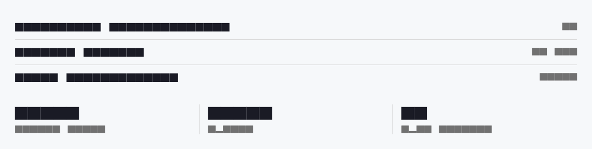
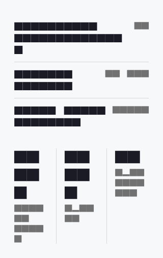

# Divider

A divider is a hairline rule that separates content without adding the visual weight of a card or a border box. Use `DsDivider` to break a long run of stacked rows into readable groups, or set `axis` to `DsDividerAxis.vertical` to split side-by-side content such as a row of summary statistics. The rule paints a single line in the theme's `colorBorder` token. It reserves exactly `thickness` logical pixels on its cross axis and fills the parent along its main axis. Use `indent` and `endIndent` to inset the line from its leading and trailing edges (handy for aligning a divider with text rather than an item's icon), and `length` to cap it at a fixed extent, centred within the available space. Because it carries no meaning of its own, the divider is hidden from assistive technologies.

Use a divider only when whitespace alone is not enough to signal a grouping. A horizontal divider fills its parent's width, so place it in a column that is already constrained; a vertical divider fills its parent's height, so give it a bounded height (for example an IntrinsicHeight row or a fixed-height container), otherwise it has no extent to fill.



*Desktop (1280dp)*



*Small phone (320dp)*

## Guidelines

**Do**

- Use a horizontal divider to separate stacked sections or list rows.
- Switch to `DsDividerAxis.vertical` for side-by-side content, and give it a bounded height to fill.
- Use `indent` / `endIndent` to align the rule with text past a leading icon or avatar.
- Set `length` when you want a short, centred rule rather than a full-width one.
- Lean on whitespace first; add a divider only when the grouping still reads as ambiguous.

**Don't**

- Don't stack dividers around every row; the borders become louder than the content.
- Don't place a vertical divider in an unbounded-height parent; it has no extent to fill.
- Don't override `color` with a heavy or branded hue; the rule should stay a quiet hairline.
- Don't use a divider as a decorative flourish where spacing would do the job.

## Example

```dart
// Separate two stacked sections.
const DsDivider();

// Inset the rule to align with text past a leading icon.
const DsDivider(indent: 44);

// A vertical rule between side-by-side stats needs a bounded height.
const SizedBox(
  height: 32,
  child: DsDivider(axis: DsDividerAxis.vertical),
);

// A short, centred rule.
const DsDivider(length: 64);
```

## See also

- [Box](box.md)
- [list](list.md)
