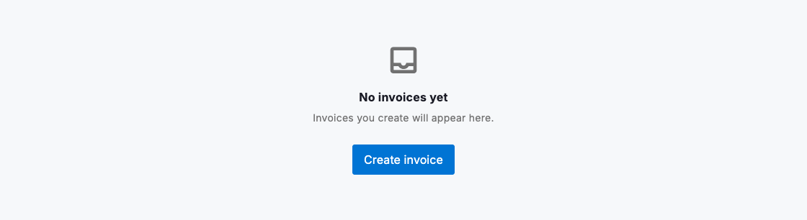
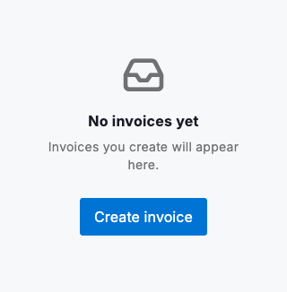

# Empty state

An empty state fills the space where records would be when a view has nothing to show yet. Use `DsEmptyState` to reassure people that the screen is working, explain why it is empty and, when they can act, point to the one next step. Give it an `icon` that echoes the missing content, a short `title`, a one-line `message` and an optional `DsEmptyStateAction` for the primary path forward. A good empty state turns a blank screen into a confident starting point rather than a dead end.

Match the copy to the reason the view is empty. When a record type has never been created, say so with a hopeful "yet" and offer the action that creates the first one. When an active filter or search returns no matches, swap the message to explain that nothing meets the current criteria and drop the create action. The fix is to adjust the filter, not to add data. Keep empty distinct from loading (use `DsSpinner`) and from error (use `DsBanner`), so people always know which situation they are in.



*Desktop (1280dp)*



*Small phone (320dp)*

## Guidelines

**Do**

- Explain why the view is empty; use "yet" when records have not been created.
- Offer one clear next action when people can create the missing data.
- Swap the message when a filter returns no matches versus when nothing exists at all.
- Keep the message short, under roughly 14 words, and lead with plain language.
- Pair the state with an icon that reflects the kind of content that is missing.

**Don't**

- Don't show a "create your first…" action when a filter just returned no matches.
- Don't use promotional or salesy language; stay calm and factual.
- Don't confuse an empty state with a loading spinner or an error banner.
- Don't stack multiple competing actions; keep to a single primary path.

## Example

```dart
DsEmptyState(
  icon: Icons.inbox_outlined,
  title: 'No invoices yet',
  message: 'Invoices you create will appear here.',
  action: DsEmptyStateAction(
    label: 'Create invoice',
    onPressed: () {},
  ),
);
```

## See also

- [Lists](lists.md)
- [Filter controls](filter-controls.md)
