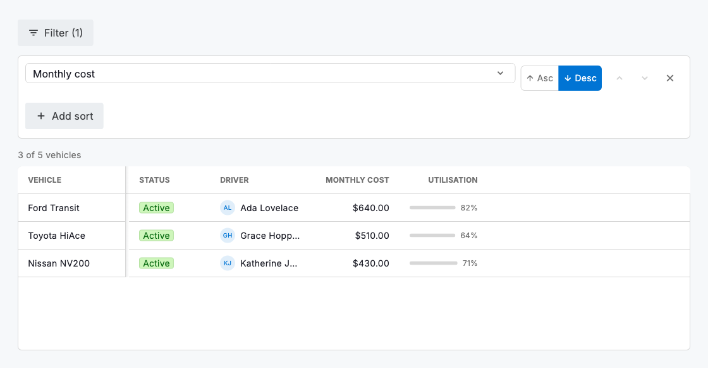
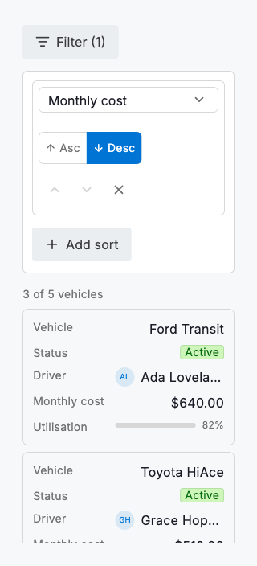

# Filtering & sorting

`DsFilterBar` and `DsSortBuilder` are the two controls that decide which records are in scope and in what order. The filter bar builds an Airtable-style compound query: a list of conditions, each with a column, a type-aware operator and a value, joined by a single And/Or. The sort builder edits an ordered list of columns, where list order is sort precedence. Both are controlled: they own no data. They hand you back an immutable `DsFilter` (or `List<DsGridSort>`) through `onChanged`, and you apply it to the rows you pass to the grid, board or list. `DsFilter` carries its own predicate (`filter.matches(row, columns)`), so the same query that drives the UI evaluates a row anywhere.

The operators offered adapt to each column's `DsCellType`: text supports contains and is/is-not; numbers and currency support greater/less than; dates support before/after and on-or-before/after; single-select and status support is-any-of; multi-select supports contains; and every type except checkbox (which is always true or false) supports is-empty / is-not-empty. The value input adapts too: a text field, a number field, a date picker or a dropdown of the column's options, so a condition can never be expressed in a way its column can't answer. `filter.matches` implements each comparison correctly (numbers numerically, dates by day, select by value, text case-insensitively) and ignores an incomplete condition rather than dropping every row.

Because `DsFilter` is a plain, serialisable model with a predicate, it is the same shape a saved view or an access policy is built from. The filter you assemble here is exactly what a policy rule evaluates later. Keep the conditions few and legible; a filter that needs a paragraph to explain is usually two saved views.



*Desktop (1280dp)*



*Small phone (320dp)*

## Guidelines

**Do**

- Let the controls stay controlled: apply `onChanged` to your own state and pass the filtered, sorted rows to the grid so every view agrees.
- Use `filter.matches(row, columns)` as the one source of truth for "is this row in scope", in the UI and in any rule that reuses the filter.
- Give select, status and date columns the metadata they need (options, a real `DateTime`) so their operators and value inputs work.
- Order multi-sorts by intent, primary key first, and keep the list short; three levels of tie-break is usually plenty.

**Don't**

- Don't hand-roll comparisons that duplicate `filter.matches`; reuse the predicate so the UI and your data layer never disagree.
- Don't mix And and Or semantics in one bar and hope it reads clearly; if a query needs both, split it into saved views.
- Don't sort by a column the data can't compare consistently; give it a real typed value or leave it out of the sort.
- Don't leave a filter applied invisibly; show the active count (the bar does) so people know why records are missing.

## Example

```dart
DsFilter filter = const DsFilter(conditions: [
  DsFilterCondition(
    columnKey: 'status',
    operator: DsFilterOperator.is_,
    value: 'active',
  ),
]);
List<DsGridSort> sorts = const [
  DsGridSort(columnKey: 'monthly', ascending: false),
];

Column(children: [
  DsFilterBar(
    columns: columns,
    value: filter,
    onChanged: (f) => setState(() => filter = f),
  ),
  DsSortBuilder(
    columns: columns,
    value: sorts,
    onChanged: (s) => setState(() => sorts = s),
  ),
  DsDataGrid(
    columns: columns,
    // The filter's own predicate decides scope; apply your sort precedence.
    rows: allRows.where((r) => filter.matches(r, columns)).toList()
      ..sort(comparatorFor(sorts)),
  ),
]);
```

## See also

- [Data grid](data-grid.md)
- [Grouping](grouping.md)
- [Board view](board-view.md)
