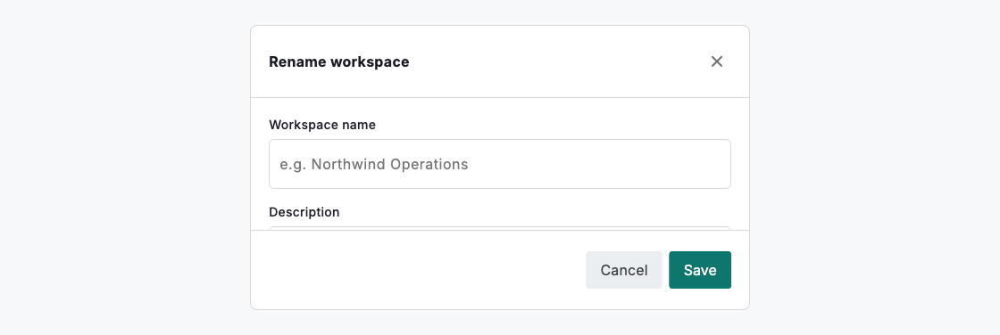
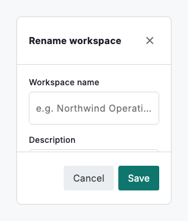

# Focus view

`DsFocusView` opens a dedicated, distraction-free surface for a single task (confirming a change, filling a short form or stepping through a sequence) without navigating away from the current screen. It is a titled panel with a scrollable body and an optional footer for the one or two actions that finish the task. The static `DsFocusView.show` presents it over the current route, honouring the `overlays` token so it appears as a centred dialog or an edge drawer; the widget itself renders a stable panel you can also embed inline.



*Desktop (1120dp)*



*Small phone (320dp)*

## Guidelines

**Do**

- Use a focus view when a task deserves the user's full attention but doesn't warrant a new page.
- Give it a clear title that names the task, and keep the body to the one thing being done.
- Put the primary action (and at most one secondary) in the footer, with the primary on the trailing edge.
- Let `DsFocusView.show` follow the `overlays` token so dialog vs drawer stays consistent across the product.
- Provide `onClose` so people always have an unambiguous way out.

**Don't**

- Don't stack focus views on top of one another; finish or dismiss one before opening the next.
- Don't fill it with a whole workflow; if it needs many steps, use the onboarding wizard or a full page.
- Don't remove the close affordance and trap the user in the task.

## Example

```dart
// Present it over the current route (dialog or drawer per the overlays token).
DsFocusView.show<bool>(
  context,
  title: 'Rename workspace',
  child: const DsTextField(label: 'Workspace name'),
  footer: DsButton(label: 'Save', onPressed: () => Navigator.of(context).pop(true)),
);

// …or embed the panel inline.
DsFocusView(
  title: 'Rename workspace',
  onClose: () => Navigator.of(context).maybePop(),
  footer: DsButton(label: 'Save', onPressed: _save),
  child: const DsTextField(label: 'Workspace name'),
);
```

## See also

- [Context view](context-view.md)
- [Onboarding wizard](onboarding-wizard.md)
