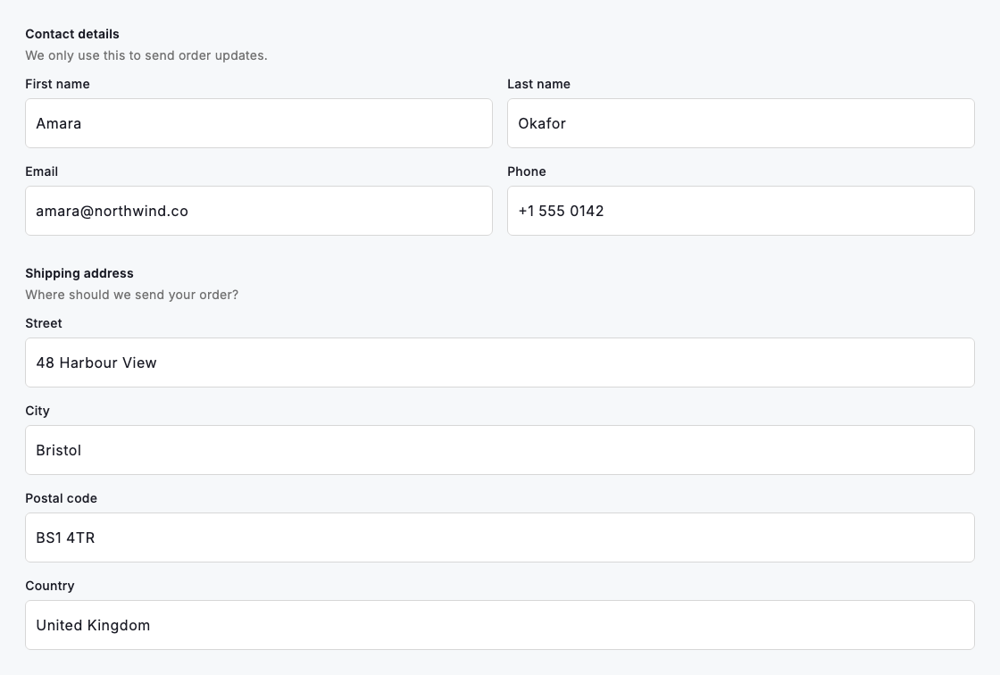
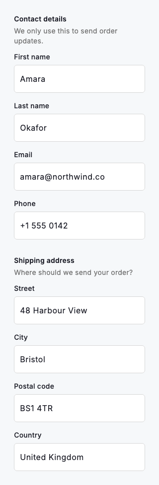

# Form field group

A form field group gathers related inputs under one legend so a long form reads as a handful of labelled sections rather than an undifferentiated stack of boxes. `DsFormFieldGroup` renders an optional legend and description, then lays out its `children` with a consistent `spacing`: it flows fields two-per-row once the group is wide enough to hold them and stacks to a single column when it is narrower, so the same markup fits a 320dp phone and a desktop pane without overflow. The threshold tracks the group's own width, so a pair of fields sits side by side inside a card as soon as there is room. The whole block is wrapped in a semantic container announced by the legend. It gives assistive technology the same "fieldset and legend" grouping a native form would.



*Desktop (1280dp)*



*Small phone (320dp)*

## Guidelines

**Do**

- Group fields that people fill in together (an address block, a name pair or a set of billing details) under a legend that names the section.
- Write a legend that is a noun phrase for the section, such as "Shipping address" or "Contact details", not an instruction.
- Add a short description when the group needs context the legend cannot carry, such as why the information is collected.
- Keep the default two columns for short, similar-width fields, and set `columns: 1` for long or full-width inputs like a street address.
- Rely on the built-in responsive layout instead of hand-rolling Rows; the group already stacks to one column when it is too narrow for two.
- Let a shared `spacing` set the rhythm within a group, and use a larger gap between separate groups so the sections stay distinct.

**Don't**

- Do not wrap a single unrelated field in a group; a lone input reads better as a plain labelled field.
- Do not pack unrelated fields under one legend just to shorten the form; the grouping should reflect real relationships.
- Do not force two columns for inputs that need the full width, such as a multi-line note; use `columns: 1` instead.
- Do not repeat the legend text inside each child label; the legend already names the group for both sighted and assistive-tech users.

## Example

```dart
// Related fields under one legend. The group flows two-per-row when it has
// room and stacks to a single column when it is narrower.
DsFormFieldGroup(
  legend: 'Contact details',
  description: 'We only use this to send order updates.',
  children: [
    DsTextField(
      label: 'First name',
      controller: firstNameController,
    ),
    DsTextField(
      label: 'Last name',
      controller: lastNameController,
    ),
    DsTextField(
      label: 'Email',
      hintText: 'you@company.com',
      keyboardType: TextInputType.emailAddress,
      controller: emailController,
    ),
    DsTextField(
      label: 'Phone',
      keyboardType: TextInputType.phone,
      controller: phoneController,
    ),
  ],
)
```

## See also

- [Text fields](text-fields.md)
- [Selection controls](selection-controls.md)
