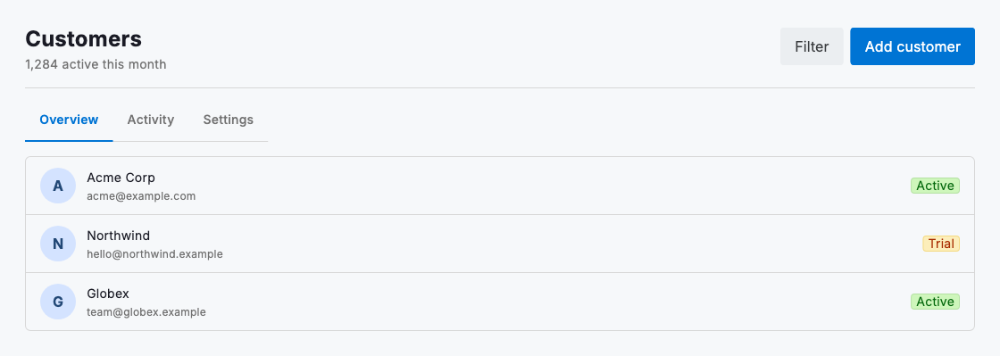
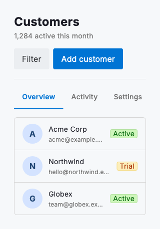

# Full-page layouts

A full page opens with a `DsPageHeader` — a clear title, a short subtitle for context, and the page's primary and secondary actions anchored to the top right. Below it, `DsTabs` splits the content into labelled sections so people meet a high-level overview first and drill into detail only when they choose to. This structure keeps every screen in the product predictable: the same header, the same action placement, and the same progressive disclosure from summary to specifics.

Lead with the information most people need on arrival and move supporting detail into later tabs. Give each section a stable, deep-linkable route so a tab can be bookmarked, shared and reopened in place — switching tabs should never reset the reader's scroll position or their earlier selections.



*Desktop (1280dp)*



*Small phone (320dp)*

## Guidelines

**Do**

- Organise content into a small set of clearly labelled tabs.
- Lead with an overview, then progressively disclose detail.
- Keep the page header and its primary actions visible.
- Use a consistent header and layout across every page.
- Give each section its own deep-linkable route.

**Don't**

- Don't surface everything on a single screen at once.
- Don't push primary actions below the fold.
- Don't nest tabs inside tabs.
- Don't reset scroll position or selection when a tab changes.

## Example

```dart
import 'package:design_system/design_system.dart';
import 'package:flutter/material.dart';

Column(
  crossAxisAlignment: CrossAxisAlignment.start,
  children: [
    DsPageHeader(
      title: 'Customers',
      subtitle: '1,284 active this month',
      actions: [
        DsButton(
          label: 'Filter',
          variant: DsButtonVariant.secondary,
          onPressed: () {},
        ),
        DsButton(label: 'Add customer', onPressed: () {}),
      ],
    ),
    DsTabs(
      tabs: const [
        DsTab(label: 'Overview'),
        DsTab(label: 'Activity'),
        DsTab(label: 'Settings'),
      ],
      selectedIndex: selectedIndex,
      onChanged: (index) => setState(() => selectedIndex = index),
    ),
    // Render the selected section's content here.
  ],
)
```

## See also

- [Lists](lists.md)
- [Filter controls](filter-controls.md)
- [Action buttons](action-buttons.md)
