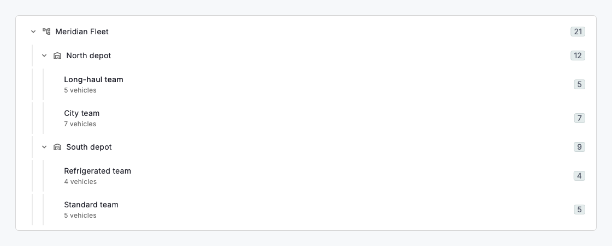
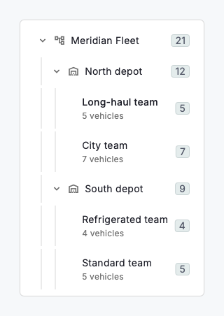

# Group hierarchy

`DsTreeView` is the standing structure your records live in: a hierarchy of groups, subgroups and children — a fleet split into depots, a depot into teams, a team holding vehicles. Where grid grouping is a view you apply and remove, the hierarchy is durable: it is how the organisation is shaped, who owns what, and where a new record belongs. Each node carries a label, an optional icon and subtitle, and a count badge; parents expand and collapse; a row selects to drive the rest of the screen; and, when you allow it, a node drags to a new parent.

The tree is built from plain `DsTreeNode`s — an id, a label and a list of children — so it maps straight onto whatever hierarchy your data already has. It is controlled or uncontrolled for both expansion (`expandedIds` / `onExpandedChanged`, or `initiallyExpandsAll`) and selection (`selectedId` / `onSelect`), so it backs both a simple always-open outline and a fully driven navigator. Reparenting is opt-in: provide `onMoveNode` and rows become draggable, reporting `(nodeId, newParentId)` — a null parent means the root — while a drop onto a node's own descendant is refused so the tree can never form a cycle. Like every data component here it never mutates its `nodes`; you apply the move and pass the new tree back.

Pair the hierarchy with the rest of the data surfaces: selecting a group scopes the grid, the board or a set of policies to that part of the organisation. A policy attached to a parent is understood to cover its children, which is what makes the hierarchy worth maintaining rather than a flat list of tags.



*Desktop (1280dp)*



*Small phone (320dp)*

## Guidelines

**Do**

- Model the hierarchy people already use — depots, teams, regions — so the tree matches how the business is actually run.
- Show a count on each node so a parent communicates its size without being expanded.
- Keep the identifying label first and let it ellipsize; put counts and actions in the trailing area so narrow screens stay readable.
- Use selection to scope the rest of the screen, and let a parent stand in for all of its children.

**Don't**

- Don't nest deeper than the organisation genuinely is; a tree that is mostly indentation is harder to navigate than a shallow one.
- Don't allow a reparent that would put a group inside its own descendant — the component refuses it, and your model should too.
- Don't overload a node with actions; a single trailing menu keeps the row scannable.
- Don't rebuild the whole tree to toggle one branch — drive expansion through state so scroll position and selection survive.

## Example

```dart
DsTreeView(
  selectedId: _selectedId,
  onSelect: (id) => setState(() => _selectedId = id),
  // Opt in to drag-to-reparent; a null parent moves the node to the root.
  onMoveNode: (move) => setState(() => _reparent(move.nodeId, move.newParentId)),
  nodes: const [
    DsTreeNode(
      id: 'north',
      label: 'North depot',
      badgeCount: 12,
      children: [
        DsTreeNode(id: 'north-longhaul', label: 'Long-haul team', badgeCount: 5),
        DsTreeNode(id: 'north-city', label: 'City team', badgeCount: 7),
      ],
    ),
    // …more depots
  ],
);
```

## See also

- [Policies](policies.md)
- [Grouping](grouping.md)
- [Data grid](data-grid.md)
