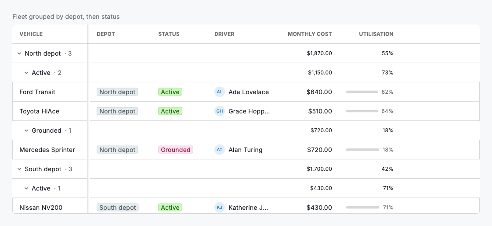
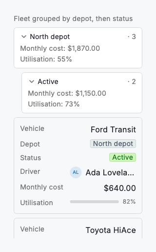

# Grouping & aggregation

Grouping turns a flat grid into an outline. Pass `DsDataGrid` a `groupBy` list of column keys and it partitions the rows under collapsible group headers: one key gives flat groups, several give nested subgroups (depot → status → …), each indented under its parent. Every header shows the group value and its record count, and an `aggregations` map rolls up a chosen column per group (a summed monthly cost, an averaged utilisation, a count) rendered aligned under its column so the summary reads like part of the table. Collapse a group to fold its rows (and subgroups) away and scan the shape of the data.

Grouping is a view over the same rows, applied after the grid's own sort, so it composes with everything else: frozen columns stay pinned, the header band and its aggregations scroll horizontally in step with the columns, and below the compact breakpoint each group becomes a labelled, collapsible section above its stacked cards. Group labels resolve select and status values through the column's `options`, format dates and currency like their cells, and read a missing value as "Ungrouped". Collapse state is the grid's own; `initiallyExpanded` sets the starting posture.

Use grouping when the question is "how do these records cluster, and what do the clusters total?": vehicles by depot and status, drivers by team, costs by category. To move records between clusters by hand, use the board view; to slice which records are in scope, use filtering.



*Desktop (1280dp)*



*Small phone (320dp)*

## Guidelines

**Do**

- Group by the attribute people compare across (a status, a depot, an owner) and add a second key only when the nesting genuinely helps.
- Aggregate the columns whose totals matter (sum a cost, average a rate) and leave the rest; a header crowded with roll-ups is hard to read.
- Give select and status group columns their `options` so headers show clean labels and colours instead of raw stored values.
- Start groups expanded for small sets and collapsed for large ones via `initiallyExpanded`, so the first screen is legible.

**Don't**

- Don't nest more than two or three levels deep; past that the indentation costs more than the structure gives back.
- Don't group by a near-unique column (an id, a free-text note); you get one record per group and lose the outline entirely.
- Don't sum a column whose values aren't additive (a rate, a ratio); average or count it instead, or leave it un-aggregated.
- Don't rely on grouping to hide records that shouldn't be there; filter them out first, then group what remains.

## Example

```dart
DsDataGrid(
  caption: 'Fleet grouped by depot, then status',
  columns: _columns,
  rows: _rows,
  // Outermost key first: depot → status subgroups.
  groupBy: const ['depot', 'status'],
  // Roll up a total and an average per group, aligned under their columns.
  aggregations: const {
    'monthly': DsAggregation.sum,
    'utilisation': DsAggregation.average,
  },
  initiallyExpanded: true,
);
```

## See also

- [Data grid](data-grid.md)
- [Board view](board-view.md)
- [Filtering & sorting](filtering-sorting.md)
