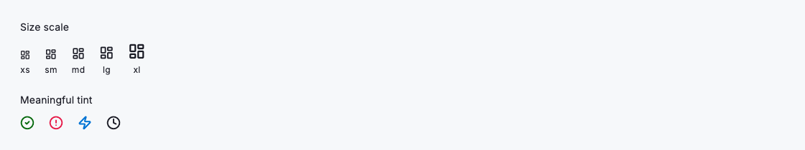
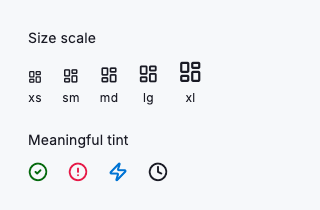

# Icon

DsIcon renders a single glyph on the shared size scale, tinted from the active theme. It is a thin, token-aware wrapper around Flutter's Icon: the size defaults to a step on the DsIconSize ramp and the colour defaults to the theme's text colour, so glyphs stay aligned with the type ramp and recolour correctly in dark and white-label builds without per-call overrides. Use a token colour only to carry meaning (danger, success or brand accent) and pass a semantic label when the glyph stands alone. Leave it null when adjacent text already says the same thing. DsIcon draws the glyph only; tap targets, tooltips and the minimum touch area belong to the control that wraps it.



*Desktop (1120dp)*



*Small phone (320dp)*

## Guidelines

**Do**

- Pick a step from DsIconSize (sm for controls, md for list rows, lg for status, xl for headers and empty states) so glyphs align with the type ramp.
- Let colour default to the theme text colour for neutral, decorative glyphs so they recolour automatically in dark and white-label themes.
- Use a token colour (colorDanger, colorPrimary, a badge status colour) only when the tint itself carries meaning.
- Pass a concise semanticLabel for meaning-bearing or icon-only glyphs so assistive technology announces their intent.
- Leave semanticLabel null for purely decorative icons that sit beside visible text, so screen readers do not announce the same thing twice.

**Don't**

- Don't hard-code an ad-hoc size like 17 or 22; choose the nearest DsIconSize step so the glyph stays on the scale.
- Don't hard-code a raw hex colour for tint; resolve it from DsTokens so it adapts to the active theme.
- Don't rely on DsIcon for interactivity; wrap it in a button or DsIconButton to get a tap target and tooltip.
- Don't label decorative icons, and don't leave an icon-only action unlabelled.

## Example

```dart
// Decorative glyph: inherits the theme text colour, no label needed.
const DsIcon(icon: DsIcons.success);

// Meaning-bearing glyph: token colour and a semantic label.
DsIcon(
  icon: DsIcons.error,
  size: DsIconSize.lg,
  color: DsTokens.of(context).colorDanger,
  semanticLabel: 'Payment failed',
);
```

## See also

- [Iconography](iconography.md)
- [Icon button](icon-button.md)
- [Inline](inline.md)
- [Link](link.md)
