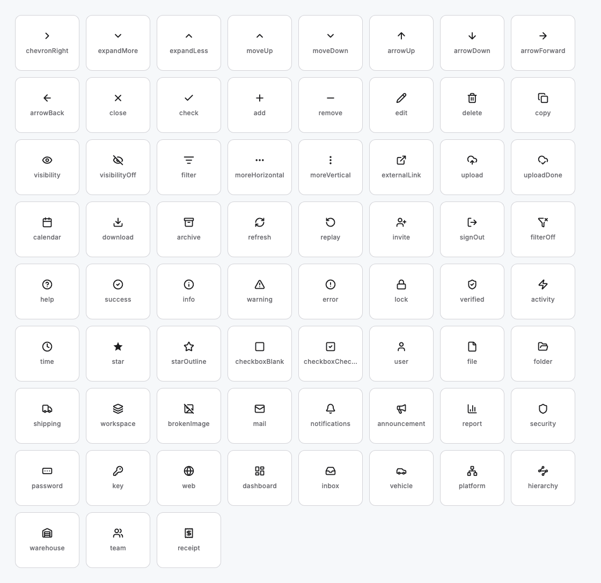
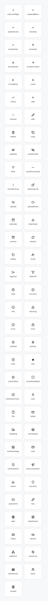

# Iconography

Icons are referenced by the role they play, not the glyph they happen to be. `DsIcons` is the system's icon vocabulary: a component asks for `DsIcons.close` or `DsIcons.success`, and the registry decides which drawing that is. Centralising it turns a pile of glyphs into a system. The family policy lives in one place, the set stays coherent and re-branding the iconography is a single file's edit rather than a hunt through every call site.

The set is drawn from Lucide, via the `flutter_lucide` package: thin, even, open line work with a consistent stroke. A short family policy keeps it honest: **outlined line glyphs** are the default for actions, affordances and status; **bare strokes** carry pure directional marks (chevrons, arrows, add, remove) that have no shape to outline; and **filled is reserved for true-state** glyphs where the fill itself is the meaning. Lucide draws outlines only, so the one true-state glyph (the selected rating star) keeps its Material solid form while the empty step uses the Lucide outline star, a deliberate, documented exception that gives rating its filled/empty contrast. Rounded, consumer-playful glyphs are the wrong register for a dense professional product and stay out of the set entirely.

Because every component reaches through the registry, iconography is part of the white-label story without being theme-aware: a brand that wants different icons forks this one file and remaps the roles to its own glyphs, and the whole system follows. Name new entries for their role (`upload`, `warning`, `externalLink`), never their appearance, so the name survives a glyph change.



*Desktop (1120dp)*



*Small phone (320dp)*

## Guidelines

**Do**

- Reference icons by role through `DsIcons`; never use `Icons.*` directly in a component or a screen.
- Add a new glyph by adding a semantic entry to the registry, so the family policy and the single swap-site stay intact.
- Keep to the outlined line family; reserve a filled glyph for a genuine true-state (a selected star), never for emphasis.
- Pair an icon-only control with a semantic label so the meaning never rests on the glyph alone.

**Don't**

- Don't scatter raw `Icons.*` through the codebase; that is the audit the registry exists to prevent.
- Don't introduce a rounded or filled Material glyph; it breaks the register. Add the Lucide line equivalent to the registry instead.
- Don't name an entry for how it looks (`filledBell`); name it for what it means (`notifications`) so a later redraw keeps the name true.
- Don't lean on colour or fill alone to carry meaning; the line work and an accessible label do the work.

## Example

```dart
// Components and screens reference the role, not the glyph.
DsIcon(icon: DsIcons.success, semanticLabel: 'Saved');

DsButton(
  label: 'Export',
  icon: DsIcons.upload,
  onPressed: _export,
);

// Re-branding is one file: fork ds_icons.dart and remap the role.
//   static const IconData close = MyBrandIcons.dismiss;
```

## See also

- [Icon](icon.md)
- [Icon button](icon-button.md)
- [Design tokens](design-tokens.md)
