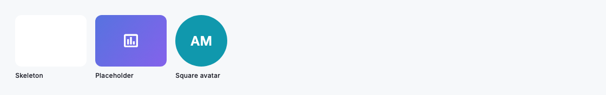
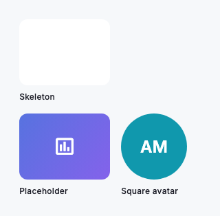

# Img

`DsImg` renders a single image inside a clipped, rounded box that always shows something sensible — never a broken glyph flashing against a blank frame. While the source loads it holds a tokened skeleton (or a placeholder you supply); if the source fails, including when there is no network at all, it settles into an error box with a muted broken-image icon and never throws. Give it an `image` provider or a network `src`, set an explicit `width` and `height` so surrounding layout stays stable from the first frame, and add a `semanticLabel` for anything that carries meaning. Every colour and the fallback radius come from the active theme, so the widget adopts your white-label palette automatically.

Always reserve space. Passing `width` and `height` lets the skeleton occupy the image's final footprint, so text and controls below it do not jump when the pixels arrive. Because `DsImg` starts no timers and no indefinite animation, it is safe to drop straight into screenshots and golden tests — with no source at all it simply shows the placeholder box.



*Desktop (1280dp)*



*Small phone (320dp)*

## Guidelines

**Do**

- Set explicit `width` and `height` so the skeleton reserves the final footprint and layout never shifts.
- Provide a `semanticLabel` for images that carry meaning; leave it null only for purely decorative art.
- Use `borderRadius` to match the surrounding surface — cards, avatars, and thumbnails.
- Supply a bespoke `placeholder` when a plain skeleton box feels too bare, e.g. a brand mark or blurred proxy.
- Choose a `fit` that suits the frame — `BoxFit.cover` fills it, `BoxFit.contain` shows the whole image.

**Don't**

- Don't wrap `DsImg` in your own error or loading handling — the graceful skeleton and error fallback are built in.
- Don't leave `semanticLabel` null on informative images; screen readers will skip them entirely.
- Don't omit `width`/`height` where the image sits above other content, or the layout will reflow on load.

## Example

```dart
DsImg(
  src: 'https://cdn.example.com/covers/quarterly-report.png',
  width: 160,
  height: 120,
  borderRadius: 12,
  fit: BoxFit.cover,
  semanticLabel: 'Quarterly report cover',
);
```

## See also

- [Avatar](avatar.md)
- [Box](box.md)
