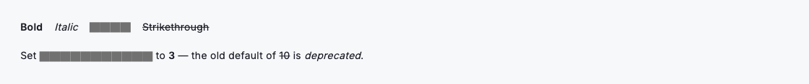
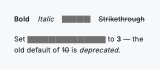

# Inline

`DsInline` styles a single run of text (bold, italic, monospace `code` or strikethrough) so a sentence can carry emphasis without leaving the flow of copy. It deliberately never sets its own font size or colour: it inherits both from the surrounding `DefaultTextStyle`, so the same treatment reads correctly inside a heading, a body paragraph or a caption without adjustment. Drop it in as a widget for a standalone run, or use the `DsInline.span` helper to combine several treatments in one `Text.rich` paragraph. Because it renders a plain `Text` with no state, timers or network work, it stays predictable everywhere it appears.



*Desktop (1280dp)*



*Small phone (320dp)*

## Guidelines

**Do**

- Use `bold` sparingly to mark the one word or phrase that carries the point.
- Use `code` when naming a field, token, endpoint or literal value.
- Let colour and size inherit from the surrounding text so runs stay in scale.
- Compose multiple treatments in one paragraph with `DsInline.span` and `Text.rich`.
- Use `strikethrough` to show a superseded value, then follow it with the new one.
- Set `semanticsLabel` when the styled glyphs would not read well aloud.

**Don't**

- Don't hard-code a `color` to fake a link. Use `DsLink` for anything tappable.
- Don't emphasise whole sentences; if everything is bold, nothing is.
- Don't stack every treatment on one run: bold-italic-code-strike is noise.
- Don't use `code` styling for prose that isn't a literal or identifier.

## Example

```dart
// A standalone emphasised run:
const DsInline(text: 'permanently', bold: true);

// Several treatments woven into one paragraph:
Text.rich(
  TextSpan(
    children: [
      const TextSpan(text: 'Set '),
      DsInline.span(context: context, text: 'retry_limit', code: true),
      const TextSpan(text: ' to '),
      DsInline.span(context: context, text: '3', bold: true),
      const TextSpan(text: '. The old default of '),
      DsInline.span(context: context, text: '10', strikethrough: true),
      const TextSpan(text: ' is deprecated.'),
    ],
  ),
);
```

## See also

- [Link](link.md)
- [Icon](icon.md)
