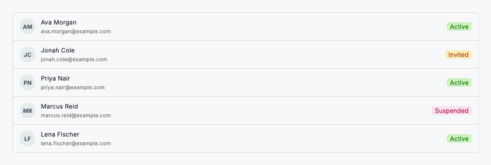
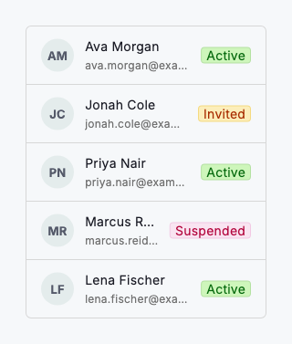

# Lists

A list presents a collection of records as stacked rows. Use `DsList` with `DsListItem` children when people need to skim a set of items (teammates, invoices, projects) and open one to see more. Each row pairs a leading icon or avatar, a primary title, an optional supporting detail and a trailing element such as a status `DsBadge` or a navigation chevron. Use a list when the goal is to recognise and select a single record; use a table when people need aligned columns to compare values across rows.

Give `DsListItem` an `onTap` to make the whole row a target. When no trailing widget is supplied, a chevron appears automatically to signal that the row navigates. Set `bordered: true` on `DsList` to group the rows into a rounded card, and keep `showDividers` on so adjacent rows stay visually separate.



*Desktop (1120dp)*



*Small phone (320dp)*

## Guidelines

**Do**

- Use DsList for straightforward, tappable collections of records.
- Give every row a clear primary title and one line of supporting detail.
- Show a record's status with a trailing DsBadge.
- Make the whole row tappable when it navigates to a detail view.

**Don't**

- Don't cram more than two lines of detail into a single row.
- Don't use a list when people need aligned columns to compare values. Use a table.
- Don't leave rows looking tappable if tapping them does nothing.

## Example

```dart
DsList(
  bordered: true,
  children: [
    DsListItem(
      leading: const CircleAvatar(child: Text('AM')),
      title: 'Ava Morgan',
      subtitle: 'ava.morgan@example.com',
      trailing: const DsBadge(
        label: 'Active',
        variant: DsBadgeVariant.success,
      ),
      onTap: () {},
    ),
    DsListItem(
      leading: const CircleAvatar(child: Text('JC')),
      title: 'Jonah Cole',
      subtitle: 'jonah.cole@example.com',
      trailing: const DsBadge(
        label: 'Invited',
        variant: DsBadgeVariant.warning,
      ),
      onTap: () {},
    ),
  ],
);
```

## See also

- [Filter controls](filter-controls.md)
- [Empty state](empty-state.md)
- [Full-page layouts](full-page-layouts.md)
