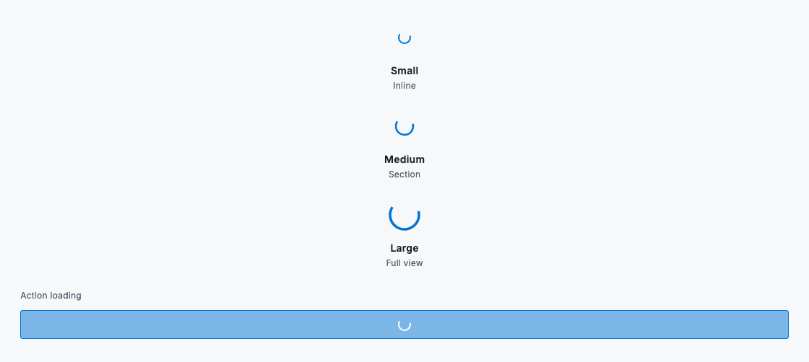
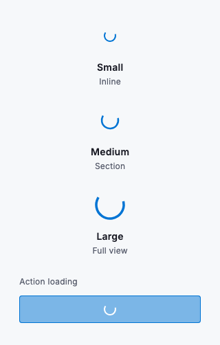

# Loading

Loading feedback tells people that work is under way and reassures them that the product is responding. Match the feedback to the scope of what is loading: use a large `DsSpinner` while a whole view resolves, a medium spinner while a section of the page fills in, and a small spinner inline beside the content it belongs to. For an action a person has just triggered — saving a record, running a report — keep the control in place and set the button's `pending` state so the label stays readable and the button becomes unavailable until the work finishes.

Give `DsSpinner` a `delay` so quick operations resolve without ever flashing an indicator — the spinner only appears if the work outlasts the delay, which avoids a distracting flicker for responses that arrive in a few hundred milliseconds. Load each region independently so a slow table never holds up the header, the navigation, or the rest of the page, and keep everything a person can still use interactive while one region catches up.



*Desktop (1280dp)*



*Small phone (320dp)*

## Guidelines

**Do**

- Match the spinner size to the scope: large for a view, medium for a section, small inline.
- Set a delay so near-instant operations never flash a spinner.
- Load sections independently so one slow region never blocks the rest.
- Use a button's pending state to show loading for an action a person triggered.
- Keep navigation and unaffected controls usable while a region loads.

**Don't**

- Don't block the whole screen when only one section is loading.
- Don't show a spinner for operations that finish almost instantly.
- Don't hide navigation or the page header while a single region loads.

## Example

```dart
Wrap(
  spacing: 32,
  crossAxisAlignment: WrapCrossAlignment.center,
  children: const [
    DsSpinner(size: DsSpinnerSize.small),
    DsSpinner(size: DsSpinnerSize.medium),
    DsSpinner(size: DsSpinnerSize.large),
  ],
);

// Action-level loading keeps the control in place.
DsButton(
  label: 'Save',
  pending: true,
  onPressed: () {},
);
```

## See also

- [Lists](lists.md)
- [Empty state](empty-state.md)
