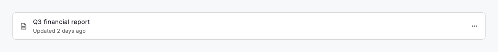
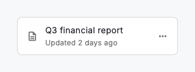

# Menu

A `DsMenu` collects the actions that belong to one object (a record, a row, an uploaded file) behind a single trigger, so a surface stays uncluttered until someone asks what they can do. Tapping the trigger opens a themed, keyboard-navigable surface of `DsMenuItem` rows; choosing one runs its `onSelected` and closes the menu automatically. Use it when a context has several secondary actions, or when showing every choice inline would crowd the layout. Each item can carry a leading icon, be disabled when temporarily unavailable or be marked `destructive` to render in the danger colour. Because the surface draws its fill, radius, border and shadow from theme tokens, a white-label skin restyles every menu at once.

A menu is for actions, not settings. If the choices are mutually exclusive states the user is picking between (a status, a sort order, a saved filter), use a `DsSelect` instead, which shows the current value and reads as a form control. Keep menus short: group related actions, order the most common first and place a `destructive` item such as Delete last, apart from the routine choices above it. Pair any irreversible action with a confirmation step rather than relying on the menu alone.



*Desktop (1280dp)*



*Small phone (320dp)*

## Guidelines

**Do**

- Use a menu for the actions that belong to one object or context.
- Give an icon-only trigger a semantic label so its purpose is announced.
- Order items by frequency, with the most common action first.
- Mark irreversible actions with `destructive` and confirm before running them.
- Disable an item with `enabled: false` when it is temporarily unavailable.
- Keep each label to a single concise verb phrase.

**Don't**

- Don't use a menu to pick between mutually exclusive states; use a select instead.
- Don't hide a page's single most important action inside a menu.
- Don't overload one menu with a long, ungrouped list of unrelated actions.
- Don't rely on the menu alone to guard a destructive action.

## Example

```dart
import 'package:design_system/design_system.dart';
import 'package:flutter/material.dart';

DsMenu(
  trigger: const DsIcon(
    icon: Icons.more_horiz,
    semanticLabel: 'Report actions',
  ),
  items: [
    DsMenuItem(
      label: 'Rename',
      icon: Icons.edit_outlined,
      onSelected: () {},
    ),
    DsMenuItem(
      label: 'Duplicate',
      icon: Icons.copy_all_outlined,
      onSelected: () {},
    ),
    DsMenuItem(
      label: 'Download',
      icon: Icons.download_outlined,
      enabled: false,
    ),
    DsMenuItem(
      label: 'Delete',
      icon: Icons.delete_outline,
      destructive: true,
      onSelected: () {},
    ),
  ],
)
```

## See also

- [Button group](button-group.md)
- [Tooltip](tooltip.md)
