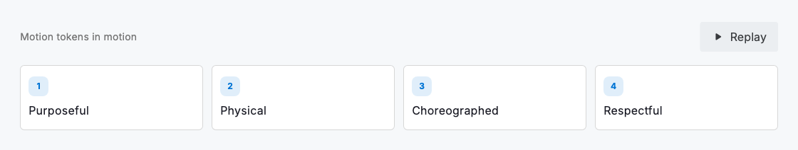
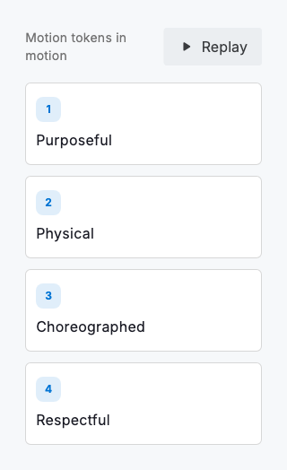

# Motion

Motion is a material, not a decoration. In this system things enter by decelerating into place, leave by accelerating away and settle with a subtle overshoot instead of snapping. That is the difference between an interface that feels mechanical and one that feels alive. `DsMotion` gives you the vocabulary to do that consistently: a small duration scale, a set of physical curves, a spring for true physics and a stagger helper for choreographing a group. Use the tokens, not raw millisecond values, so every surface moves with the same hand.

Three ideas run through all of it. **Purposeful.** Motion earns its place by explaining a change (where a thing came from, where it went) or directing attention, never as ornament. **Physical.** Easing mimics real objects: quick to start, softly landing, with weight; the `settle` curve and the `spring` give an arrival the hint of overshoot that reads as alive. **Choreographed.** When several elements change together, stagger them a beat apart with `DsMotion.stagger` so the sequence has cause and effect rather than a simultaneous jump.

## Duration scale

| Name | Type | Example value | Description |
| --- | --- | --- | --- |
| `DsMotion.instant` | `Duration` | `0ms` | No motion: an immediate change. What every other duration collapses to under reduced motion. |
| `DsMotion.fast` | `Duration` | `120ms` | Micro-interactions: hover, press, a toggle flipping. |
| `DsMotion.base` | `Duration` | `220ms` | The standard transition for most state changes. |
| `DsMotion.slow` | `Duration` | `360ms` | Larger surfaces (sheets, dialogs, an accordion) where time reads as weight. |
| `DsMotion.expressive` | `Duration` | `520ms` | Choreographed, hero moments. Use sparingly; it is a spotlight. |

## Curves

| Name | Type | Example value | Description |
| --- | --- | --- | --- |
| `DsMotion.standard` | `Curve` | `easeOutCubic` | The everyday gentle decelerate into place. |
| `DsMotion.emphasized` | `Curve` | `cubic(0.2, 0, 0, 1)` | A strong decelerate for entrances: fast off the mark, softly landing. |
| `DsMotion.decelerate` | `Curve` | `cubic(0.05, 0.7, 0.1, 1)` | Pure decelerate for elements arriving from off-screen. |
| `DsMotion.accelerate` | `Curve` | `cubic(0.3, 0, 0.8, 0.15)` | Accelerate for elements leaving the screen entirely. |
| `DsMotion.settle` | `Curve` | `cubic(0.34, 1.35, 0.64, 1)` | A physical settle with a restrained overshoot: the premium, alive arrival. |

## Physics

For motion driven by a simulation rather than a fixed timeline (a dragged card released, a pull gesture snapping back), two tuned springs replace duration and curve.

| Name | Type | Example value | Description |
| --- | --- | --- | --- |
| `DsMotion.spring` | `SpringDescription` | `damping 22` | A near-critically-damped spring for physics-driven motion: a dragged card snapping back, only a hint of overshoot. |
| `DsMotion.bounce` | `SpringDescription` | `damping 10` | An under-damped spring for a tactile, playful bounce: a button releasing. Visibly overshoots and settles. |

## Helpers

Never read the raw tokens in an animating widget; resolve them through the helpers below so every call site honours reduce-motion by construction.

| Name | Type | Example value | Description |
| --- | --- | --- | --- |
| `DsMotion.durationOf(context, full)` | `Duration` | `base → 0ms` | Returns full when motion is allowed and Duration.zero under reduce-motion. |
| `DsMotion.curveOf(context, full)` | `Curve` | `settle → linear` | Returns full when motion is allowed and Curves.linear under reduce-motion; there is no easing to perceive across a zero-length animation. |
| `DsMotion.stagger(context, index)` | `Duration` | `40ms × index` | The delay before the item at index begins in a choreographed group, stepped 40ms apart and capped at 240ms. Zero under reduce-motion so the group arrives together. |
| `DsMotion.reduced(context)` | `bool` | `false` | Whether the platform asks for reduced motion. Gate any bespoke animation behind it. |

One law above all: **respect reduced motion.** When a person has asked their platform for less motion, animation is not softened. It is removed. Resolve every duration and curve through `DsMotion.durationOf` and `DsMotion.curveOf`, which collapse to a still, instant change under the setting, and gate any bespoke animation behind `DsMotion.reduced`. The live demo obeys this: press Replay with reduce-motion on and it stays put.



*Desktop (1120dp)*



*Small phone (320dp)*

## Guidelines

**Do**

- Use the duration scale and curves; a bespoke millisecond value is a motion that agrees with nothing else on screen.
- Let entrances decelerate (`emphasized`) and exits accelerate (`accelerate`). Motion should mirror how real objects arrive and leave.
- Choreograph a group with `DsMotion.stagger` so a reveal reads as a sequence, not a simultaneous pop.
- Resolve durations and curves through `durationOf` / `curveOf`, and gate custom animation on `DsMotion.reduced`, so reduce-motion is honoured everywhere by construction.

**Don't**

- Don't animate for its own sake; if a motion doesn't explain a change or guide attention, cut it.
- Don't use a bouncy elastic curve: `settle` gives a hint of overshoot; more than that reads as a toy, not a tool.
- Don't run long or looping animation on content people are trying to read; reserve `expressive` for genuine moments.
- Don't ship an animation that ignores reduce-motion. That is an accessibility defect, not a polish gap.

## Example

```dart
// Resolve tokens through the reduce-motion-aware helpers.
AnimatedContainer(
  duration: DsMotion.durationOf(context, DsMotion.base),
  curve: DsMotion.curveOf(context, DsMotion.emphasized),
  // …
);

// Choreograph a group from one controller: each item animates a
// staggered slice of the timeline and settles into place. The offset
// comes from DsMotion.stagger, which collapses to zero under
// reduce-motion so the group arrives together, instantly.
final start = DsMotion.stagger(context, index).inMilliseconds /
    controller.duration!.inMilliseconds;
final reveal = CurvedAnimation(
  parent: controller,
  curve: Interval(start, 1, curve: DsMotion.settle),
);
```

## See also

- [Design tokens](design-tokens.md)
