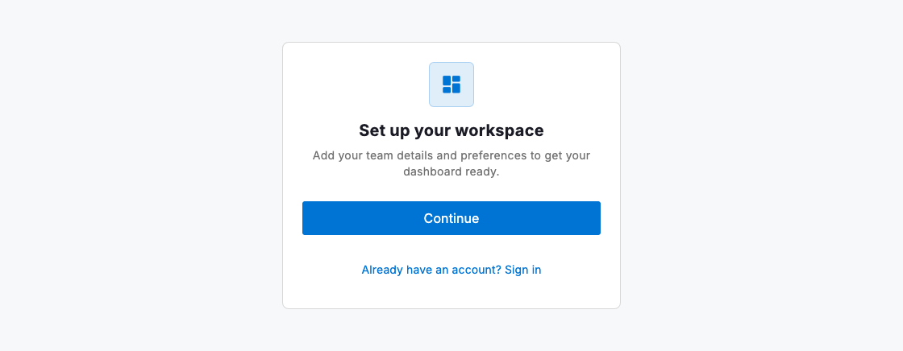
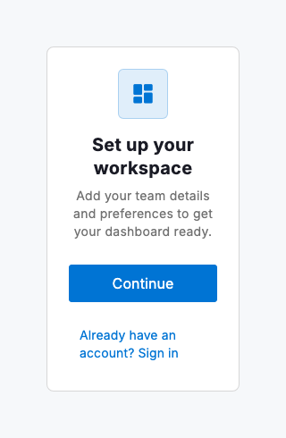

# Onboarding

Onboarding moves a new person from signed-out to productive with the smallest set of steps that matter. Lead with a single, centred welcome card that names what they are setting up, states the value in one line, and offers one obvious primary action. Build it with `DsSignInView`: it presents the brand mark, title, description and a full-width Continue button, and deliberately collects no credentials of its own so you can hand sensitive input to a flow you control and return the user when they are done.

Treat the first screen as an invitation, not a form. Every field or step you add before the user reaches value is a chance to lose them, so defer anything that is not required to get started. As accounts grow more complex, layer additional setup behind the reveal or across a `DsProgressStepper` rather than crowding the opening card.



*Desktop (1280dp)*



*Small phone (320dp)*

## Guidelines

**Do**

- Keep onboarding to the essential steps needed to reach a first useful moment.
- Make the primary action unmistakable — one full-width button labelled "Continue".
- Collect sensitive credentials on your own secure sign-in, then return the user to where they left off.
- Scale complexity to the person: show more setup only when their account actually needs it.
- State the value in the description so the user knows why the step is worth taking.

**Don't**

- Don't use onboarding for promotions, cross-sells or unrelated announcements.
- Don't collect passwords or payment details on a screen you don't fully control.
- Don't add steps that aren't required to get started — defer the rest.
- Don't bury the primary action beneath competing links or dense copy.

## Example

```dart
DsSignInView(
  brandIcon: Icons.dashboard_rounded,
  brandColor: DsTokens.of(context).buttonPrimaryColorBackground,
  title: 'Set up your workspace',
  description:
      'Add your team details and preferences to get your dashboard ready.',
  primaryAction: DsSignInAction(
    label: 'Continue',
    onPressed: () => _startSetup(),
  ),
  footer: TextButton(
    onPressed: () => _signInInstead(),
    child: const Text('Already have an account? Sign in'),
  ),
);
```

## See also

- [Sign in](sign-in.md)
- [Additional context](additional-context.md)
- [Progress stepping](progress-stepping.md)
