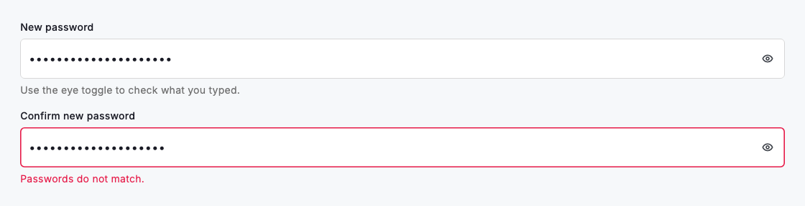
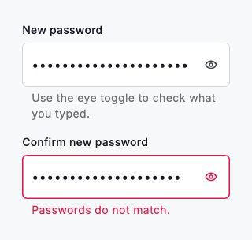

# Password field

`DsPasswordField` is a `DsTextField` set up to obscure what the user types, with an eye toggle in the suffix that shows or hides the value. It keeps its own show and hide state, so you wire up only the field props a password needs. It forwards `controller`, `hintText`, `errorText`, `onChanged`, `onSubmitted`, `textInputAction`, `enabled`, `autofocus` and `focusNode` straight to the underlying field. Use it anywhere someone enters a password: sign-in, sign-up and change-password forms.



*Desktop (1120dp)*



*Small phone (320dp)*

## Guidelines

**Do**

- Use DsPasswordField for every password input so the show and hide toggle behaves the same everywhere.
- Set errorText to report a failed rule or a mismatch; it moves the field into its error state.
- Pass a controller when another widget needs to read the value, such as a strength meter.
- Set textInputAction and onSubmitted so people can submit the form from the keyboard.

**Don't**

- Don't build your own obscure toggle on a plain DsTextField; use this field instead.
- Don't reveal the value by default; the field starts obscured on purpose.
- Don't put the strength meter inside the field; render DsPasswordStrength below it.
- Don't disable the field to make it read-only; a disabled field drops out of the focus order.

## Example

```dart
DsPasswordField(
  label: 'Password',
  hintText: 'Enter your password',
  textInputAction: TextInputAction.done,
  errorText: _submitted && _password.isEmpty
      ? 'Enter your password'
      : null,
  onChanged: (value) => setState(() => _password = value),
  onSubmitted: (_) => _signIn(),
);
```

## See also

- [Text fields](text-fields.md)
- [Password strength](password-strength.md)
