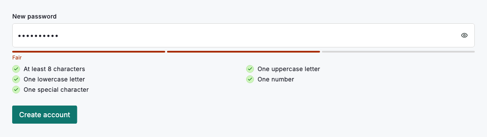
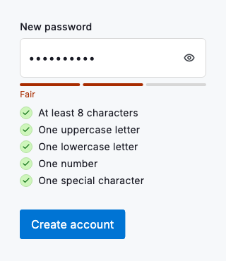

# Password strength

`DsPasswordStrength` reads a password value and shows two things: a three-segment meter tinted by strength, and a two-column checklist that ticks each rule as it is met. Pass the current `value` and it recomputes on every keystroke, so the guidance stays live while someone types. Set `showChecklist: false` to keep the meter on its own where space is tight. The same grading is exposed as a pure model, so a form can validate with the exact logic the meter shows.

The widget shows guidance; the model decides. `dsPasswordRules(value)` returns the same rules the checklist renders, `dsPasswordMeetsAll(value)` is true once every rule passes, and `dsPasswordTier(value)` grades the value from too weak up to strong, holding common words, brand words passed as `brandWords` and the usual word plus number plus symbol shape down even when every rule passes. `dsFirstUnmetPasswordRule(value)` returns the first unmet rule's message (null once all pass), ready for a field's error caption. Gate the submit button on the model and leave the widget to explain why.



*Desktop (1120dp)*



*Small phone (320dp)*

## Guidelines

**Do**

- Render DsPasswordStrength below the password field so the meter tracks what the user types.
- Gate the submit button with dsPasswordMeetsAll rather than reading the meter's colour.
- Set showChecklist: false on compact forms where the meter alone is enough.
- Feed it the same value your controller holds so the readout never lags the field.

**Don't**

- Don't treat the meter as validation; check dsPasswordMeetsAll before you submit.
- Don't show the checklist and the field's own rule text at once; pick one place for the rules.
- Don't hide the meter until submit; live feedback is the point.
- Don't reword the rules in your copy; they come from dsPasswordRules and must match.

## Example

```dart
Column(
  crossAxisAlignment: CrossAxisAlignment.start,
  children: [
    DsPasswordField(
      label: 'New password',
      controller: _controller,
      onChanged: (value) => setState(() => _password = value),
    ),
    const SizedBox(height: 8),
    DsPasswordStrength(value: _password),
    const SizedBox(height: 16),
    DsButton(
      label: 'Create account',
      onPressed:
          dsPasswordMeetsAll(_password) ? _createAccount : null,
    ),
  ],
);
```

## See also

- [Password field](password-field.md)
