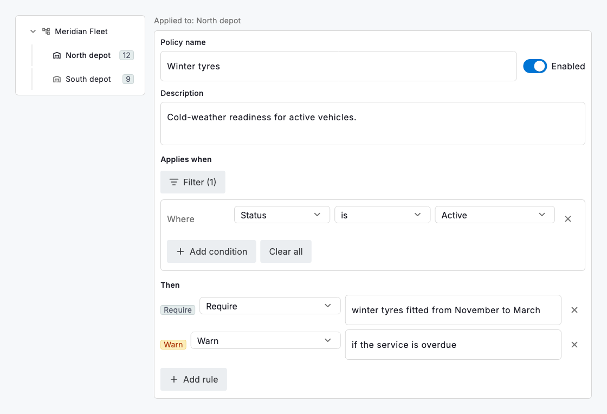
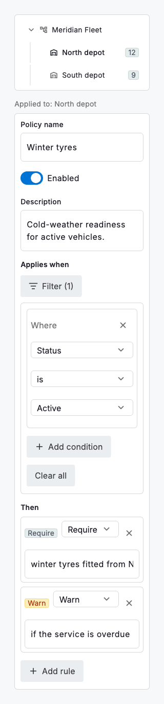

# Policies & rules

A policy is a rule you author once and apply to a part of the fleet: "for active vehicles, require winter tyres from November and warn if the service is overdue." `DsPolicyBuilder` captures exactly that shape: a name, an enable switch, an "applies when" condition and a list of "then" rules. The condition is a `DsFilter`, the very same model the filter bar produces, so the query you would use to find records is the query that scopes a policy; `policy.appliesTo(row, columns)` answers "is this record covered?" with the same predicate. Each rule pairs an effect (require, restrict, warn or auto-tag) with a short description of what it demands.

Create and apply are two steps. You build the policy here (its condition and rules) and you apply it by attaching it to a node in the group hierarchy; a policy on a depot covers the teams and vehicles beneath it. Because the condition is a plain `DsFilter` and `appliesTo` is a pure predicate, the same policy can drive the UI (which records to badge, which to block) and a background check (which records violate it) without a second definition drifting out of sync. An empty condition means the policy applies to every record in the group it is attached to.

The builder is controlled: it holds no copy of the policy and emits a new immutable `DsPolicy` on every edit, so a policy is as serialisable and auditable as any other record. Keep a policy to one clear intent with a handful of rules; when it needs a paragraph of conditions, it is usually two policies.



*Desktop (1280dp)*



*Small phone (320dp)*

## Guidelines

**Do**

- Name a policy for its intent ("Winter tyres", "Hazmat clearance") so a list of policies reads like a checklist of what the fleet must satisfy.
- Scope with the condition, not by hand-picking records; a `DsFilter` keeps the policy correct as vehicles come and go.
- Apply a policy at the highest group that should carry it and let it flow to the children, rather than repeating it on each.
- Use `appliesTo` as the single check for coverage in both the interface and any enforcement job.

**Don't**

- Don't encode one-off exceptions as rules; a policy is a standing requirement, not a note about a single vehicle.
- Don't leave a policy enabled with no rules. It reads as governance that does nothing; disable it or give it a rule.
- Don't duplicate a filter's logic in a separate enforcement path; reuse `policy.appliesTo` so the two can never disagree.
- Don't stack many unrelated rules in one policy; split them so each can be enabled, audited and explained on its own.

## Example

```dart
DsPolicyBuilder(
  columns: columns,           // the fields the condition can reference
  value: policy,
  onChanged: (p) => setState(() => policy = p),
);

// The authored policy is a plain, serialisable model…
const policy = DsPolicy(
  id: 'winter-tyres',
  name: 'Winter tyres',
  filter: DsFilter(conditions: [
    DsFilterCondition(columnKey: 'status', operator: DsFilterOperator.is_, value: 'active'),
  ]),
  rules: [
    DsPolicyRule(effect: DsPolicyEffect.require, description: 'winter tyres from November to March'),
    DsPolicyRule(effect: DsPolicyEffect.warn, description: 'if the service is overdue'),
  ],
);

// …that evaluates a record with the same predicate the filter bar uses.
final covered = policy.appliesTo(row, columns);
```

## See also

- [Group hierarchy](group-hierarchy.md)
- [Filtering & sorting](filtering-sorting.md)
- [Data grid](data-grid.md)
