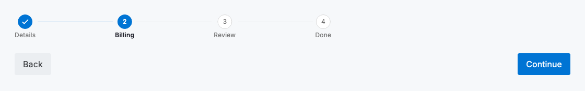
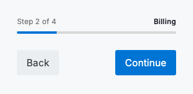

# Progress stepping

A progress stepper turns a multi-step task into something the user can read at a glance: it names every stage, marks the ones already completed, and highlights where they are right now. Reach for `DsProgressStepper` when work is split across a small, fixed set of ordered stages — a setup wizard, a guided report build, a review-and-confirm flow — so the user always knows how far they have come and how much is left. Pair it with a footer that carries the step navigation: a secondary "Back" and a primary "Continue", with the final stage landing on a single confirming action.

The stepper communicates position; the footer moves the user through it. Keep those responsibilities separate so the header stays a stable map of the task while the actions stay predictably in the same place on every stage. Because the stepper is purely declarative, drive it from the same index that governs your form state — advance the index only once the current stage validates, and the completed, current and upcoming states stay honest.



*Desktop (1280dp)*



*Small phone (320dp)*

## Guidelines

**Do**

- Give every step a short, plain label so the whole task is legible at a glance.
- Make the current position obvious and mark completed steps as done.
- Keep step navigation in a consistent footer — Back on the left, the forward action on the right.
- Make the final action a primary button that clearly confirms and completes the task.
- Keep the number of steps small; group related fields rather than adding stages.

**Don't**

- Don't hide progress partway through a long task — the user should always see where they are.
- Don't let people lose their place; preserve the current step and entered data on Back.
- Don't use a stepper for a single-step task where there is no progress to show.
- Don't move the navigation buttons around between steps.

## Example

```dart
DsProgressStepper(
  steps: const [
    DsStep(label: 'Details'),
    DsStep(label: 'Billing'),
    DsStep(label: 'Review'),
    DsStep(label: 'Done'),
  ],
  currentIndex: 1,
);

Row(
  children: [
    DsButton(
      label: 'Back',
      variant: DsButtonVariant.secondary,
      onPressed: () => _goTo(0),
    ),
    const Spacer(),
    DsButton(
      label: 'Continue',
      onPressed: () => _goTo(2),
    ),
  ],
);
```

## See also

- [Waiting screens](waiting-screens.md)
- [Onboarding](onboarding.md)
