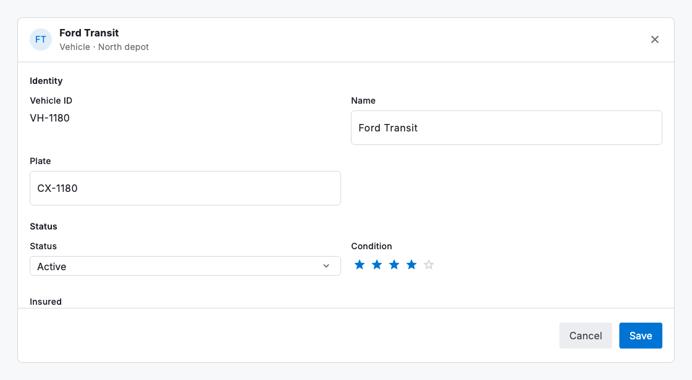
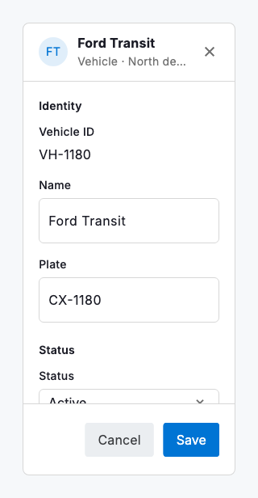

# Record panel

When the grid is for scanning many records, `DsRecordPanel` is for working one in full. It is the titled detail surface — an Airtable record modal, a HubSpot record page — that shows every field of a single vehicle or driver as a typed, editable form. The fields are the same `DsGridColumn`s the grid uses and the values a plain `Map<String, Object?>`, so the panel opens whatever the grid shows without a second model. It sits in the same family as the context and focus views: a header with a title and close, a scrollable body, and a footer for Save and Cancel.

Each field renders the editor its `DsCellType` calls for — a text field, a currency or date field, a select of the column's options, a switch, a star row — and keys listed in `readOnlyKeys` (plus any computed field) render as display value rather than an input. The panel is controlled: it holds no copy of the record and emits the full updated map through `onChanged` on every edit, so your state stays the single source of truth and the same record edits consistently here, in an inline grid cell, or after an import. Creating a record and editing one are the same panel — an empty values map and a "New vehicle" title is a create; a populated map is an edit.

Group related fields with `DsRecordFieldGroup` — identity, status, assignment — and the panel lays them out as titled sections that stack to one column on a phone and flow to two where there is room. A long form is easier to complete when it is chunked into the few things a person actually reasons about together.



*Desktop (1280dp)*



*Small phone (320dp)*

## Guidelines

**Do**

- Reuse the grid's `DsGridColumn`s as the record's fields so the detail view and the table never disagree about types or options.
- Keep the panel controlled — apply `onChanged` to your state so an edit here shows everywhere the record appears.
- Group fields into a few meaningful sections; a flat wall of inputs is harder to complete than three short ones.
- Use the same panel for create and edit — an empty map is a new record — so people learn one surface.

**Don't**

- Don't build a separate model for the detail view; the panel speaks the same `DsGridColumn` / values map as everything else.
- Don't make a derived or system-owned field editable; list it in `readOnlyKeys` so it reads clearly without inviting a change that can't save.
- Don't cram forty fields into one ungrouped scroll; section them so the panel stays navigable.
- Don't trap the person — always provide a close affordance alongside Save.

## Example

```dart
DsRecordPanel(
  title: 'Ford Transit',
  subtitle: 'Vehicle · North depot',
  columns: columns,               // the same DsGridColumns the grid uses
  values: record,                 // Map<String, Object?>; {} to create a new record
  readOnlyKeys: const {'id'},
  groups: const [
    DsRecordFieldGroup(title: 'Identity', columnKeys: ['id', 'vehicle', 'plate']),
    DsRecordFieldGroup(title: 'Status', columnKeys: ['status', 'condition', 'insured']),
    DsRecordFieldGroup(title: 'Assignment & cost', columnKeys: ['driver', 'monthly', 'serviceDue']),
  ],
  onChanged: (values) => setState(() => record = values),
  onSave: _save,
  onClose: () => Navigator.of(context).maybePop(),
);
```

## See also

- [Data grid](data-grid.md)
- [Cell types & editing](cell-types.md)
- [Data import](data-import.md)
