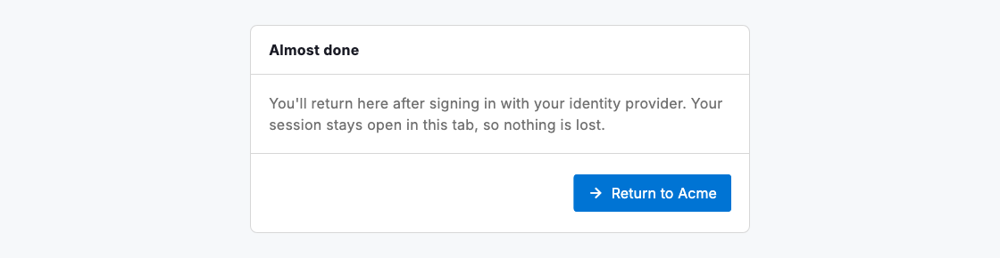
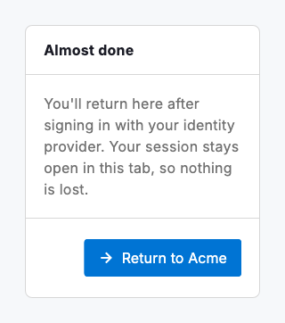

# Redirects

Some flows hand the user off to an external provider — an SSO or identity provider, for example — and then bring them back. The moment they return is fragile: people need to know they are in the right place and how to continue. Show a short, centered panel that names what just happened and offers a single call to action to return, all in the same tab so no context is lost.

Keep the handoff and the return symmetrical. Send the user to the provider in the same tab, and bring them back to a panel that confirms where they are and what to do next. A single primary action — worded as a clear destination, such as "Return to Acme" — removes any doubt about how to get back into the product.

Set expectations before and after the redirect. Tell people what they are about to do ("sign in with your identity provider") and reassure them on the way back that their place is preserved. Match the panel to the rest of the product so the return never feels like a different application.



*Desktop (1280dp)*



*Small phone (320dp)*

## Guidelines

**Do**

- Offer a single, clearly worded call to action to return, naming the destination the user is going back to.
- Set context so people know what just happened and what comes next.
- Keep both the handoff and the return in the same tab.
- Match the panel to the rest of the product so the return feels seamless.

**Don't**

- Open the return in a new tab or window, which strands the original one.
- Leave people unsure how to get back into the product.
- Break visual consistency with a page that looks like another app.

## Example

```dart
DsFocusView(
  title: 'Almost done',
  child: Text(
    "You'll return here after signing in with your identity provider.",
  ),
  footer: DsButton(
    label: 'Return to Acme',
    icon: Icons.arrow_forward,
    onPressed: _continue,
  ),
)
```

## See also

- [Waiting screens](waiting-screens.md)
- [Sign in](sign-in.md)
