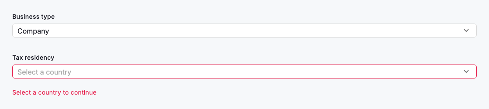
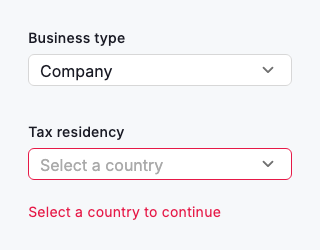

# Select

A `DsSelect` lets someone choose one value from a longer list without spending the vertical space a full set of radios would demand. It is generic over its value type, so each `DsSelectOption` carries an enum or domain value rather than a loose string, and the chosen value flows straight back through `onChanged`. Use a select once a field has roughly five or more options. Give it a visible label and lead the empty state with a hint that names the decision.

Order the options in a way people can predict (alphabetical, by frequency or in a natural sequence) so the list is quick to skim rather than something to read end to end. When a submitted value fails validation, surface the reason through `errorText` directly beneath the field; the control shifts to its error styling and the message stays visible until the choice is corrected. Guidance that applies before any error lives in `helperText`, a subdued line beneath the field that an `errorText` temporarily replaces. Inside a `Form`, pass a `validator` instead and the field reports its own message when the form validates; `autovalidateMode` controls when that happens and `onSaved` receives the chosen value when the form is saved.



*Desktop (1120dp)*



*Small phone (320dp)*

## Guidelines

**Do**

- Use a select once a field offers roughly five or more options, where radios would take too much vertical space.
- Give every select a visible label that names the decision, such as "Business type".
- Provide a hint for the empty state so the untouched field reads as a prompt, not a blank.
- Order options predictably (alphabetically, by frequency or in a natural sequence) so people can find a value quickly.
- Show validation inline with `errorText` and keep it visible until the value is corrected.

**Don't**

- Do not use a select for two or three options; expose them with radios or a segmented control so every choice is visible at once.
- Do not leave a select without a label; a bare field forces people to guess what they are choosing.
- Do not hide validation errors or defer them to a distant banner; anchor the message to the field.

## Example

```dart
// Keep the selected value in state and let onChanged drive it.
String? businessType;

DsSelect<String>(
  label: 'Business type',
  hintText: 'Select a business type',
  value: businessType,
  onChanged: (v) => setState(() => businessType = v),
  options: const [
    DsSelectOption(value: 'sole_trader', label: 'Sole trader'),
    DsSelectOption(value: 'company', label: 'Company'),
    DsSelectOption(value: 'partnership', label: 'Partnership'),
    DsSelectOption(value: 'trust', label: 'Trust'),
  ],
)

// The same control shows validation inline via errorText.
DsSelect<String>(
  label: 'Tax residency',
  hintText: 'Select a country',
  value: null,
  errorText: 'Select a country to continue',
  onChanged: (v) => setState(() => residency = v),
  options: const [
    DsSelectOption(value: 'au', label: 'Australia'),
    DsSelectOption(value: 'nz', label: 'New Zealand'),
    DsSelectOption(value: 'sg', label: 'Singapore'),
  ],
)
```

## See also

- [Text fields](text-fields.md)
- [Selection controls](selection-controls.md)
