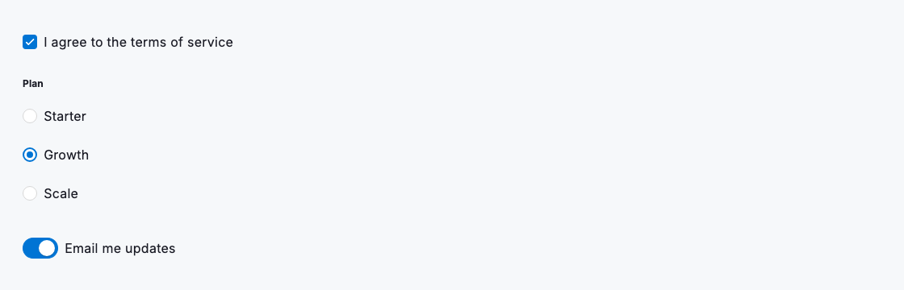
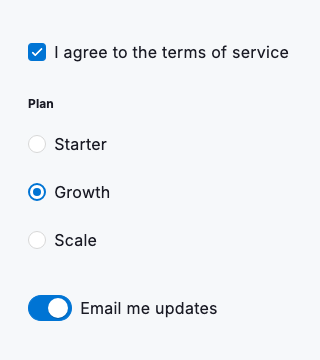

# Selection controls

Selection controls capture a choice without a text entry, and each one answers a different question. A `DsCheckbox` toggles an independent option or records a single consent — "I agree to the terms". A group of `DsRadio` widgets sharing one `groupValue` presents a mutually exclusive set where exactly one option wins, such as a plan tier. A `DsSwitch` flips a single setting that takes effect the moment it moves, like "Email me updates". Choosing the right control tells people, at a glance, how many answers they may give and whether the change is instant or waits for a Save.

All three controls are driven entirely by the value you pass and report changes back through a single callback, so the widget owns no state of its own — you keep the truth in your model and rebuild. Write labels as the outcome the person is choosing, not the mechanism, and make the whole label a tap target so no one has to aim for the box or thumb. When a radio group has an expected default, select it up front so the form is never in a blank, invalid state.



*Desktop (1280dp)*



*Small phone (320dp)*

## Guidelines

**Do**

- Use a checkbox for independent options and for consent, where each choice stands on its own.
- Use a group of radios for a mutually exclusive choice, where picking one clears the rest.
- Use a switch for a single setting that should take effect immediately, with no Save step.
- Write labels that name the outcome — "Email me updates" — so the choice is clear without extra help text.
- Give every control at least a 48dp tap target, and let the label share it.

**Don't**

- Do not use two radios for a single yes/no question — reach for one checkbox or a switch instead.
- Do not use a switch for a change that must be confirmed with a Save; use a checkbox inside the form.
- Do not leave a radio group with no default selected when the form expects one answer.
- Do not describe the control mechanics in the label; describe what the person gets.

## Example

```dart
// Keep the choices in state; the controls are driven by value and
// report changes through a single callback.
bool agreed = false;
String plan = 'growth';
bool emailUpdates = true;

Column(
  crossAxisAlignment: CrossAxisAlignment.start,
  children: [
    // Independent option / consent.
    DsCheckbox(
      value: agreed,
      label: 'I agree to the terms of service',
      onChanged: (v) => setState(() => agreed = v),
    ),

    // Mutually exclusive choice — one shared groupValue.
    DsRadio<String>(
      value: 'starter',
      groupValue: plan,
      label: 'Starter',
      onChanged: (v) => setState(() => plan = v!),
    ),
    DsRadio<String>(
      value: 'growth',
      groupValue: plan,
      label: 'Growth',
      onChanged: (v) => setState(() => plan = v!),
    ),
    DsRadio<String>(
      value: 'scale',
      groupValue: plan,
      label: 'Scale',
      onChanged: (v) => setState(() => plan = v!),
    ),

    // Immediate setting — no Save.
    DsSwitch(
      value: emailUpdates,
      label: 'Email me updates',
      onChanged: (v) => setState(() => emailUpdates = v),
    ),
  ],
)
```

## See also

- [Text fields](text-fields.md)
- [Select](select.md)
