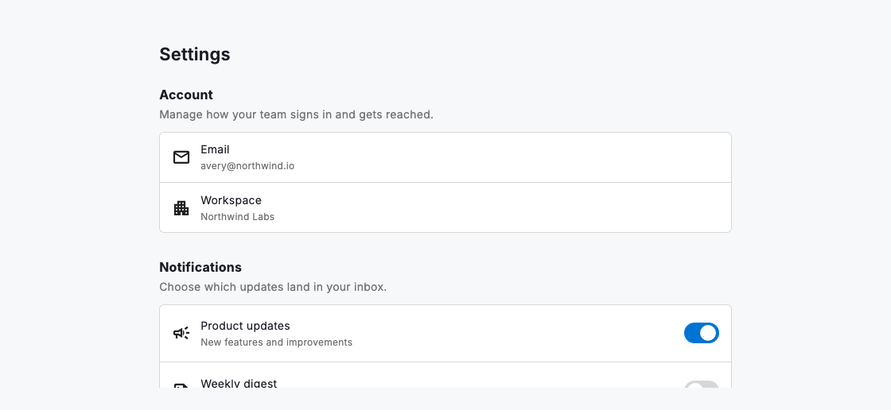
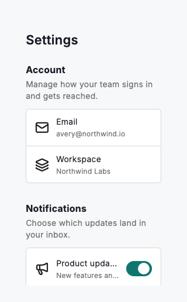

# Settings view

`DsSettingsView` organises a preferences screen into titled `DsSettingsSection`s, each a heading and optional description above a bordered card that stacks its rows behind hairline dividers. It centres the content column, caps it at `maxContentWidth` on wide screens and tightens the horizontal padding on compact phones, so the same page reads cleanly from 320dp to desktop. Rows are ordinary widgets (most often a `DsListItem` carrying a value, a `DsSwitch` or a navigation chevron) and the whole page scrolls as one `ListView`, so a screen can grow to any number of sections without special handling. An optional `header` anchors the page title and a `footer` holds a closing action such as sign-out.



*Desktop (1280dp)*



*Small phone (320dp)*

## Guidelines

**Do**

- Group related settings into sections with short, clear titles.
- Add a section description when the controls need context or a caveat.
- Use a DsSwitch for preferences that take effect immediately.
- Give each row a clear label and, where useful, its current value as a subtitle.
- Put the page title in the header and closing actions in the footer.
- Order sections from most to least frequently changed.

**Don't**

- Don't pile unrelated controls into one long, untitled list.
- Don't use a switch for a choice the user must confirm before it applies; use a form field.
- Don't nest a scrolling area inside a section; let the whole view scroll as one.
- Don't let the content column stretch edge to edge on wide screens.

## Example

```dart
import 'package:design_system/design_system.dart';
import 'package:flutter/material.dart';

DsSettingsView(
  header: const Text('Settings'),
  sections: [
    const DsSettingsSection(
      title: 'Account',
      description: 'Manage how your team signs in.',
      children: [
        DsListItem(
          leading: Icon(Icons.mail_outline),
          title: 'Email',
          subtitle: 'avery@northwind.io',
        ),
      ],
    ),
    DsSettingsSection(
      title: 'Notifications',
      children: [
        DsListItem(
          leading: const Icon(Icons.campaign_outlined),
          title: 'Product updates',
          trailing: DsSwitch(
            value: productUpdates,
            onChanged: (v) => setState(() => productUpdates = v),
          ),
        ),
      ],
    ),
  ],
  footer: DsButton(
    label: 'Sign out',
    variant: DsButtonVariant.secondary,
    onPressed: signOut,
  ),
)
```

## See also

- [Form field group](form-field-group.md)
- [Context view](context-view.md)
