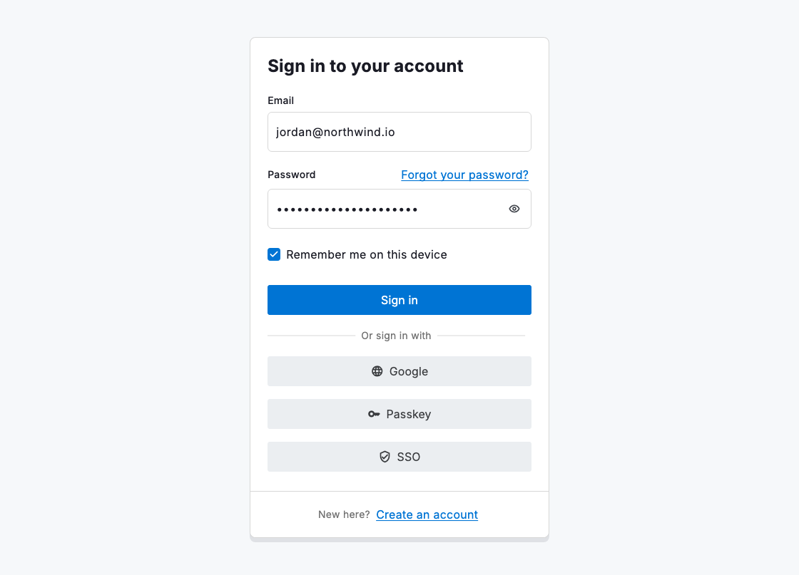
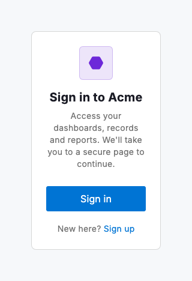

# Sign in

The sign-in view is the front door to your product: a single, centred card that gets a returning person in with as little friction as possible. In its form-led composition `DsSignInView` opens with a left-aligned heading (`headingAlignment: DsHeadingAlignment.start`), then your `form`: an email field, a password block whose label row carries the forgot-password link (a `DsFieldLabel` and a `DsLink` above a `DsPasswordField`) and a remember-me `DsCheckbox`. Below the full-width primary action, a `DsLabeledDivider` introduces the alternative providers as `DsButton.social` rows, and the create-account prompt sits apart in the edge-to-edge tinted `footerBand`. The card owns none of the form's state or validation; you pass the fields in and handle submission, so the same view backs a password sign-in, a passkey or an SSO hand-off just by changing what you put in `form` and `footer`.

Keep it to the two things people came to do: enter their details and get in. Lead with a short, left-aligned heading, keep the primary button the obvious next step and put recovery (forgot password) on the password label row where people look for it. Alternative providers belong below the primary action behind an "Or sign in with" divider, so the password path stays the default and the alternatives read as equals among themselves. The `footerBand` keeps the new-user path visible without competing with the form: its tint and hairline mark it as a separate room. Surface a failed attempt with a `DsBanner` above the form or an `errorText` on the offending field rather than a bare sentence.

The composition flexes through a handful of optional parameters. Dropping the `form` and adding a `brandIcon` turns it into a redirect or SSO card: the glyph sits in a tinted rounded square above the title (filled with `brandColor`, or the primary button background when omitted) and a supporting `description` renders beneath. `onClose` adds a corner close button and insets the heading so the title never paints beneath it. `showBorder: false` lets the card rest on its shadow alone. `additionalContextLabel` with `additionalContext` tucks supplementary detail, such as terms or enterprise sign-in options, behind a lightweight reveal below the footer.



*Desktop (1120dp)*



*Small phone (320dp)*

## Guidelines

**Do**

- Give people the two obvious paths: signing in (the primary action) and creating an account (the `footerBand`).
- Compose the password label row from a `DsFieldLabel` and a right-aligned `DsLink`, then a `DsPasswordField` beneath, so recovery sits where people reach for it.
- Put alternative providers behind a `DsLabeledDivider` and render each as a `DsButton.social`, so every provider row reads identically.
- Offer a remember-me `DsCheckbox` when sessions expire, and default it to checked on consumer products.
- Surface a failed sign-in clearly (a banner above the form) and keep the fields filled so they can correct one thing.

**Don't**

- Don't crowd the card with links and options; the two paths, recovery and a short provider list are enough.
- Don't hide which action signs in; the full-width primary button should be unmistakable, with the providers visually secondary below the divider.
- Don't put the create-account prompt inside the form body; the `footerBand` separates it so new people spot it without it competing.
- Don't reinvent the inputs; use `DsTextField` and `DsPasswordField` so the form matches every other form in the product.

## Example

```dart
DsSignInView(
  title: 'Sign in to your account',
  headingAlignment: DsHeadingAlignment.start,
  form: Column(
    crossAxisAlignment: CrossAxisAlignment.stretch,
    children: [
      if (_error) ...[
        const DsBanner(
          variant: DsBannerVariant.danger,
          title: 'Incorrect email or password.',
        ),
        const SizedBox(height: DsSpacing.lg),
      ],
      DsTextField(
        label: 'Email',
        hintText: 'you@company.com',
        keyboardType: TextInputType.emailAddress,
        controller: _email,
      ),
      const SizedBox(height: DsSpacing.lg),
      Row(
        children: [
          const DsFieldLabel(label: 'Password'),
          Expanded(
            child: Align(
              alignment: Alignment.centerRight,
              child: DsLink(label: 'Forgot your password?', onPressed: _recover),
            ),
          ),
        ],
      ),
      const SizedBox(height: DsSpacing.xs),
      DsPasswordField(controller: _password),
      const SizedBox(height: DsSpacing.md),
      DsCheckbox(
        value: _remember,
        onChanged: (v) => setState(() => _remember = v),
        label: 'Remember me on this device',
      ),
    ],
  ),
  primaryAction: DsSignInAction(label: 'Sign in', onPressed: _submit),
  footer: Column(
    crossAxisAlignment: CrossAxisAlignment.stretch,
    children: [
      const DsLabeledDivider(label: 'Or sign in with'),
      const SizedBox(height: DsSpacing.lg),
      DsButton.social(icon: DsIcons.web, label: 'Google', onPressed: _google),
      const SizedBox(height: DsSpacing.md),
      DsButton.social(icon: DsIcons.key, label: 'Passkey', onPressed: _passkey),
      const SizedBox(height: DsSpacing.md),
      DsButton.social(icon: DsIcons.verified, label: 'SSO', onPressed: _sso),
    ],
  ),
  footerBand: Wrap(
    crossAxisAlignment: WrapCrossAlignment.center,
    children: [
      Text('New here? ', style: tokens.bodySm.toTextStyle(
        color: tokens.colorSecondaryText,
      )),
      DsLink(label: 'Create an account', onPressed: _goToSignUp),
    ],
  ),
)
```

## See also

- [Sign up](sign-up.md)
- [Password field](password-field.md)
- [Field label](field-label.md)
- [Labelled divider](labeled-divider.md)
- [Communicating state](communicating-state.md)
