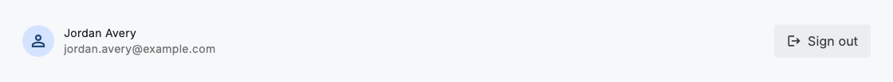
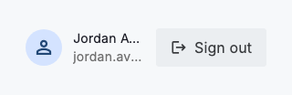

# Sign out

Every authenticated experience needs an easy, discoverable way to leave it. Sign out lives where people instinctively look for it — in the account menu or at the foot of settings — and reads as a plain, labelled action rather than a stray icon. A small account footer that pairs the signed-in identity with a secondary "Sign out" button makes the current session obvious and gives people a calm, one-tap way to end it.

Keep the control consistently located across the product so people build muscle memory for it, and always show the account it belongs to so there is no doubt about who is signed in. Signing out should be immediate; only interrupt with a confirmation when there is unsaved work that leaving would discard.



*Desktop (1280dp)*



*Small phone (320dp)*

## Guidelines

**Do**

- Place sign out where people expect it — the account menu or the foot of settings.
- Keep it visible and consistently located across every authenticated screen.
- Show the signed-in identity next to the control so the session is unambiguous.
- Confirm only when there is unsaved work that signing out would lose.

**Don't**

- Don't bury sign out several levels deep or behind an overflow menu.
- Don't hide it behind an unlabelled icon that people have to guess at.
- Don't block a routine sign out with an unnecessary confirmation dialog.

## Example

```dart
Row(
  children: [
    const CircleAvatar(child: Icon(Icons.person_outline)),
    const SizedBox(width: 12),
    const Expanded(
      child: Column(
        crossAxisAlignment: CrossAxisAlignment.start,
        children: [
          Text('Jordan Avery'),
          Text('jordan.avery@example.com'),
        ],
      ),
    ),
    DsButton(
      label: 'Sign out',
      variant: DsButtonVariant.secondary,
      icon: Icons.logout,
      onPressed: () {},
    ),
  ],
)
```

## See also

- [Sign in](sign-in.md)
- [Settings sign in](settings-sign-in.md)
