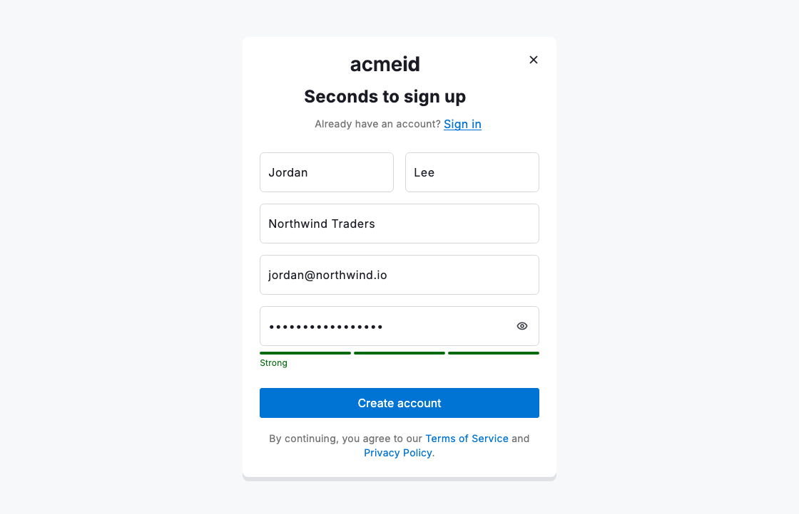
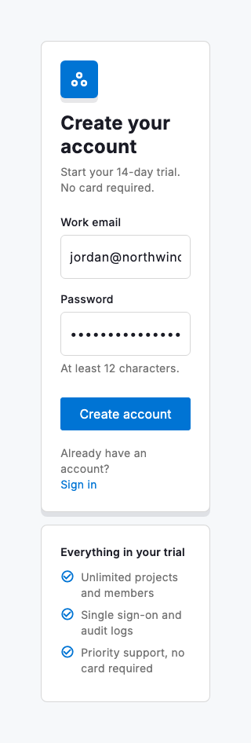

# Sign up

The sign-up view turns a first visit into an account. `DsSignUpView` frames registration as one focused, brand-led card: a `header` wordmark centred with `headingAlignment`, a short title, an "Already have an account?" prompt in the `aboveForm` slot, your own form and a single full-width primary action. The scaffold owns only the surrounding layout, spacing and responsive behaviour: you supply the `form` (typically a `DsFormFieldGroup` and fields) and own its validation, while `onSubmit` creates the account. Keep the button live and validate on submit, so a press that cannot go through reveals every error at once and moves focus to the first field to fix, rather than a dead, greyed-out button; pass `null` only when you do want it disabled. `onClose` adds a corner close for a card opened over another surface, and `showBorder: false` lets the card rest on its shadow alone.

Ask for the fewest fields you truly need, then validate them where the user is looking. Name and surname share one `DsFormFieldGroup` row and stack on narrow screens. Format-free required fields, such as name and company, validate on blur: the message appears once the user has typed into a field and left it empty, then clears live as they type, so a field they never touched is not flagged just for tabbing past it, and a skipped one still surfaces on submit. The work email validates live once touched: a format check surfaces "This email is invalid" and a directory check "Email already taken", both through the field's `errorText`. The password is captioned by `dsFirstUnmetPasswordRule`, which names one rule at a time so the error always says the next thing to fix, and a `DsPasswordStrength` meter beneath the field grades the value as it is typed. A `DsPasswordStrengthHint` line sits below the meter: it restates the requirements while a basic rule is unmet, then, once every rule passes but the value still grades weak, warns against a guessable password, and shows nothing otherwise. The primary button stays live: a press that cannot go through reveals every field's error at once and moves focus to the first one to fix, so no one is left guessing what a greyed-out button wants. While the request is in flight, set `submitPending` to show a spinner and block repeat taps; the view never touches the network or a timer itself, so it renders identically in a screenshot and in production.

For a glyph-led card, pass `brandIcon` in place of the wordmark `header`: it renders in a tinted rounded square above the title, filled with `brandColor` or the primary button background when that is omitted. A short `description` beneath the title carries supporting copy, such as the trial terms, so the form itself stays lean.

Earlier revisions of this pattern paired the card with a benefits `aside`. The slot still exists for trial-style layouts, but this composition drops it: the single card keeps attention on the form, and the terms line in the `footer` stays short so the primary action is never buried.



*Desktop (1120dp)*



*Small phone (320dp)*

## Guidelines

**Do**

- Ask for the fewest fields that let someone get started, then progressively collect the rest.
- Put name and surname in one `DsFormFieldGroup` row; the group stacks them itself when the card narrows.
- Validate format-free required fields on blur, then clear the error live as the value is typed.
- Validate the email live once touched: a format check first, then the taken-address check, both through `errorText`.
- Caption the password with `dsFirstUnmetPasswordRule` so the error always names the next rule to fix.
- Keep `onSubmit` live and validate on submit: reveal every error at once and move focus to the first invalid field.
- Use `submitPending` while the request is in flight to prevent duplicate submissions.

**Don't**

- Don't flag an error before the field is touched; an empty field is not yet wrong until the user leaves it or submits.
- Don't leave the primary button greyed-out with nothing said; an enabled button that reveals what is missing beats a dead one.
- Don't list every unmet password rule at once; the ladder shows one message at a time.
- Don't crowd the card with links that pull people out before they finish.
- Don't bury the primary action beneath long terms copy; one short line under the button is enough.
- Don't add an `aside` to this composition; the card stands alone by design.

## Example

```dart
DsSignUpView(
  header: DsWordmark(
    primary: 'acme',
    accent: 'id',
    fontSize: tokens.headingXl.fontSize,
  ),
  headingAlignment: DsHeadingAlignment.center,
  showBorder: false,
  onClose: _abandonSignUp,
  title: 'Seconds to sign up',
  aboveForm: Wrap(
    alignment: WrapAlignment.center,
    crossAxisAlignment: WrapCrossAlignment.center,
    children: [
      Text('Already have an account?',
          style: tokens.bodySm.toTextStyle(color: tokens.colorSecondaryText)),
      DsLink(label: 'Sign in', onPressed: _goToSignIn),
    ],
  ),
  form: Column(
    crossAxisAlignment: CrossAxisAlignment.stretch,
    children: [
      // Name and surname share a row; the group stacks them when narrow.
      // Required, format-free fields validate on blur, then clear as you type.
      DsFormFieldGroup(
        children: [
          DsTextField(
            controller: _name,
            focusNode: _nameFocus,
            hintText: 'Name',
            errorText: _nameTouched
                ? _requiredError(_name.text, 'Enter your name')
                : null,
          ),
          DsTextField(
            controller: _surname,
            focusNode: _surnameFocus,
            hintText: 'Surname',
            errorText: _surnameTouched
                ? _requiredError(_surname.text, 'Enter your surname')
                : null,
          ),
        ],
      ),
      const SizedBox(height: DsSpacing.lg),
      DsTextField(
        controller: _company,
        focusNode: _companyFocus,
        hintText: 'Company name',
        errorText: _companyTouched
            ? _requiredError(_company.text, 'Enter your company name')
            : null,
      ),
      const SizedBox(height: DsSpacing.lg),
      DsTextField(
        controller: _email,
        focusNode: _emailFocus,
        hintText: 'Work email',
        keyboardType: TextInputType.emailAddress,
        onChanged: (_) => setState(() => _emailTouched = true),
        // Empty, 'This email is invalid' or 'Email already taken', live.
        errorText: _emailTouched ? _emailError(_email.text) : null,
      ),
      const SizedBox(height: DsSpacing.lg),
      DsPasswordField(
        controller: _password,
        focusNode: _passwordFocus,
        hintText: 'Password',
        // Cue password managers to generate and save, not fill a stored value.
        newPassword: true,
        onChanged: (_) => setState(() => _passwordTouched = true),
        // One rule at a time: the first unmet rule is the next fix.
        errorText: _passwordTouched
            ? dsFirstUnmetPasswordRule(_password.text)
            : null,
      ),
      const SizedBox(height: DsSpacing.sm),
      DsPasswordStrength(value: _password.text, showChecklist: false),
      DsPasswordStrengthHint(value: _password.text),
    ],
  ),
  primaryActionLabel: 'Create account',
  // Stays enabled; a press reveals every error and focuses the first to fix.
  onSubmit: _trySubmit,
  submitPending: _submitting,
  footer: Text.rich(
    textAlign: TextAlign.center,
    TextSpan(
      style: tokens.bodySm.toTextStyle(color: tokens.colorSecondaryText),
      children: [
        const TextSpan(text: 'By continuing, you agree to our '),
        TextSpan(text: 'Terms of Service',
            style: TextStyle(color: tokens.actionPrimaryColorText)),
        const TextSpan(text: ' and '),
        TextSpan(text: 'Privacy Policy',
            style: TextStyle(color: tokens.actionPrimaryColorText)),
        const TextSpan(text: '.'),
      ],
    ),
  ),
)
```

## See also

- [Sign in](sign-in.md)
- [Onboarding](onboarding.md)
- [Password strength](password-strength.md)
