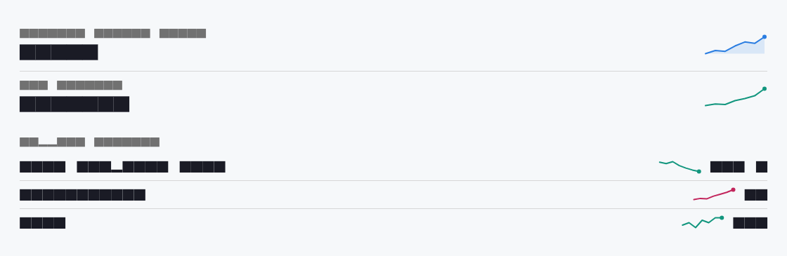
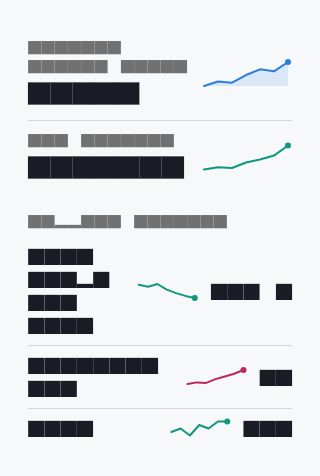

# Sparkline

A sparkline is a tiny, word-sized line chart that shows the shape of a trend: no axes, gridlines, labels or legend. `DsSparkline` normalises its `values` to fill a compact `width` × `height` box and draws them as a 2px polyline, so it slots inline beside a metric or inside a dense table cell where a full chart would be too heavy. The line colour defaults to the first hue of the validated `DsChartPalette` for the active theme brightness; pass `color` to echo a value's status from elsewhere in the UI. Turn on `filled` for a soft translucent area beneath the line, and keep `showEndDot` on to anchor the eye at the latest point. A sparkline communicates direction and momentum, not precise figures. Always pair it with the actual number it trends, because the plot is auto-scaled to its own min and max and reads nothing on its own.

Each sparkline scales independently to its own range, so two side by side are not comparable in absolute terms: a gentle real change and a tiny noisy one can look equally dramatic. Use sparklines to answer "is this going up, down or holding steady?" and reserve axed line charts for when the reader needs to compare series or read values off the plot. Zero- and one-point inputs are handled: an empty list draws nothing, and a single value draws just a centred dot.



*Desktop (1280dp)*



*Small phone (320dp)*

## Guidelines

**Do**

- Always show the real, current value next to the sparkline. The plot conveys shape, never a number.
- Keep the box small and consistent so a column of sparklines lines up as a set.
- Pass `color` to mirror a value's status (for example a positive trend in the palette's positive hue) when the sign carries meaning.
- Turn on `filled` to emphasise a headline metric, and leave `showEndDot` on to mark the latest point.
- Feed enough points (roughly 7 to 30) to reveal a trend without turning into noise.
- Use `DsLineChart` instead when the reader must compare series or read values off an axis.

**Don't**

- Don't treat two sparklines as comparable. Each auto-scales to its own min and max, so heights are not on a shared scale.
- Don't present a sparkline as the only figure; without its number it says direction but not magnitude.
- Don't stretch the box large enough that it reads as a full chart the eye expects axes on. Use `DsLineChart` at that size.
- Don't override `color` with a decorative or branded hue that fights the meaning of the metric.

## Example

```dart
// A headline metric with an inline trend.
Row(
  crossAxisAlignment: CrossAxisAlignment.center,
  children: [
    const Expanded(child: Text('Monthly active users')),
    const SizedBox(width: 12),
    DsSparkline(
      values: const [820, 932, 901, 1090, 1230, 1180, 1410],
      filled: true,
      color: DsChartPalette.colorAt(0, Theme.of(context).brightness),
    ),
  ],
),

// A status-coloured trend in a dense table cell.
DsSparkline(
  values: const [4.8, 4.5, 4.9, 4.1, 3.6, 3.2, 2.9],
  color: DsChartPalette.divergingPositive,
  width: 72,
  height: 24,
),
```

## See also

- [Line chart](line-chart.md)
- [Bar chart](bar-chart.md)
