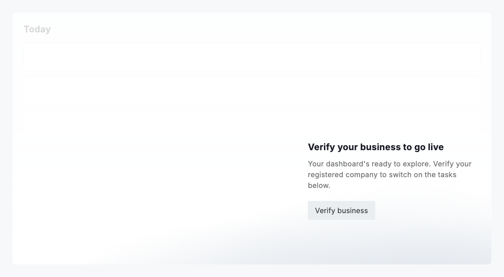
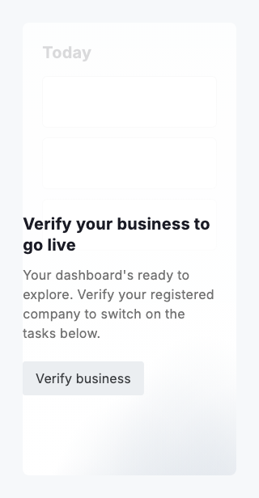

# Spotlight

`DsSpotlight` is the first-run coach a user meets on a fresh page: a translucent wash that fades the page out, a brand bloom rising from the bottom and a short message with one action anchored near the bottom edge. It nudges the next step, "verify your business to go live" or "add your first vehicle", as a gentle per-step prompt rather than a hard gate.

The spotlight overlays the page it is given as its `child`. The wash is the page colour deepening downward, so the content reads faintly up top and recedes into a near-opaque surface below, and a `DsBrandBloom.pools` glow sits behind the message. On a skin the bloom carries the brand stops; on the neutral base it stays a single quiet hue.

The wash is a modal barrier. The page is wrapped so it cannot be tapped, read by assistive technology or reached by keyboard while the spotlight is up, and a page field that was focused when the spotlight mounts is released on the first frame. Only the message and its action stay live.

The message floats bottom-right by default, clearing `messageRightInset` so it dodges a panel floating in the same corner, such as a setup guide. Set `docked` on compact layouts and it bottom-centres instead. On a short viewport its bottom inset shrinks and the message scrolls, so the heading yields before the action does.



*Desktop (1120dp)*



*Small phone (320dp)*

## Guidelines

**Do**

- Pass the whole page as the child so the spotlight can hold it inert while the nudge is up.
- Raise messageRightInset to clear a floating panel, and set docked where the layout puts a panel along the bottom.
- Keep the message to one step: a heading, a line of context and one action.
- Suppress a floating panel that would sit under the message while the spotlight is up, so the two never nudge at once.

**Don't**

- Do not use it as a blocking dialog; a DsTakeover is the surface for a step the user must finish or close.
- Do not bake brand colour into the wash or bloom; both flow through DsTokens, so a skin tints them.
- Do not stack more than one action into the message; the spotlight points at a single next step.

## Example

```dart
DsSpotlight(
  title: 'Verify your business to go live',
  body: 'Verify your registered company to switch on the tasks below.',
  actionLabel: 'Verify business',
  onAction: _openVerification,
  docked: isCompact,
  child: dashboard,
);
```

## See also

- [Setup guide](setup-guide.md)
- [Coachmark](coachmark.md)
- [Brand bloom](brand-bloom.md)
