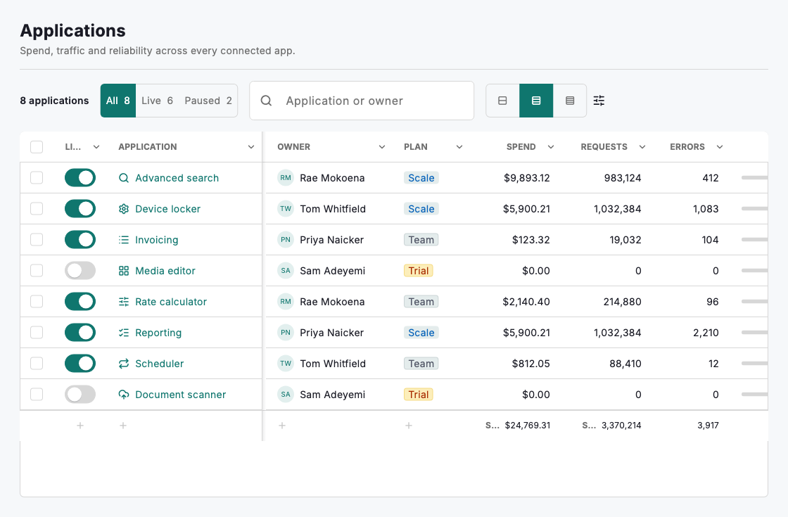
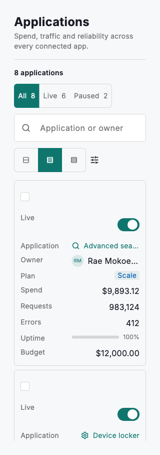

# Table workbench

The whole working-table screen, assembled from parts that already exist. A `DsRosterView` supplies the shell — title, record count, segment filters, search, a toolbar and a docked detail panel — and carries a `DsDataGrid` through it. Into the toolbar go the two controls that change how the table reads rather than what it shows: a `DsSegmentedControl` over `DsGridDensity`, and a `DsCheckMenu` driving `DsGridView.visibleColumns`. The grid freezes the columns that identify a record, renders an interactive switch through a `cellBuilder`, types every other column so it sorts and aligns by convention, and totals the numeric ones in a calculations footer. Tapping a row opens a `DsRecordPanel` beside the table on a wide window, and as a takeover on a narrow one.

This page is a composition, not a component. Nothing here is a new widget: it is the roster view, the data grid, the record panel, the segmented control and the check menu, wired to one screen's state. That state stays in one place — the query, the segment, the density, the view, the selection and the open record are all held by the screen, and every part is handed what it needs and reports back what changed. Copy the shape rather than the data: the same wiring backs a table of invoices, devices, people or jobs.

Two columns are frozen and locked out of the column picker, so a row always keeps something to identify it by however far the rest scrolls sideways, and the picker can never leave the table with nothing to show. The first of them is a custom cell: `DsGridColumn.cellBuilder` receives the raw value *and* the row, so a switch inside a cell knows which record to report. A column with a `cellBuilder` is exempt from inline editing, because the builder owns the whole cell — the two would otherwise fight over the same tap.

Density is a systematic choice, not three hand-picked numbers. `DsGridDensity` is the vocabulary — comfortable, cosy, compact — and the heights behind it are tokens (`DsTokens.tableRowHeightCosy` and its pair), so a brand that reads denser or airier than the base restyles every table at once through its skin rather than each table passing its own number. Pass `rowHeight` only for a table whose cells genuinely need a size no density describes. Below the grid's `compactBreakpoint` none of this applies: the table re-flows into stacked cards whose controls are full size, which is how the same screen stays usable on a phone.



*Desktop (1120dp)*



*Small phone (320dp)*

## Guidelines

**Do**

- Hold the screen's state in one place and hand each part what it needs; every control here is controlled.
- Freeze — and lock out of the column picker — the columns that identify a record, so a row is never anonymous and the table is never empty.
- Use `cellBuilder` when a cell needs to be interactive or to pair two things (a glyph and a name); use a `DsCellType` for everything else, so it sorts and aligns for free.
- Put controls that change how the table reads (density, visible columns) in the toolbar, and controls that change what it shows (segments, search) above it.
- Total the numeric columns with `DsGridView.calculations` rather than appending a fake summary row to the data.
- Let the detail panel take over on narrow windows instead of squeezing it alongside the table.

**Don't**

- Don't build a new organism for this screen — it is a composition of the roster view, the grid and the record panel.
- Don't put a density or column control in the toolbar without wiring it through to the grid; a control that does not reach its target is worse than none.
- Don't set both `editable` and a `cellBuilder` on one column and expect both; the builder wins and inline editing is dropped.
- Don't freeze more than the identifying columns — every frozen column eats the width the rest of the table scrolls through.
- Don't keep the switch's state inside the cell. The cell reports the change and the screen owns the answer.

## Example

```dart
import 'package:design_system/design_system.dart';
import 'package:flutter/material.dart';

DsRosterView(
  title: 'Applications',
  countLabel: '8 applications',
  segments: const [
    DsRosterSegment(value: 'all', label: 'All', count: 8),
    DsRosterSegment(value: 'live', label: 'Live', count: 6),
  ],
  segmentValue: 'all',
  onSegmentChanged: (next) {},
  searchHint: 'Application or owner',
  onSearchChanged: (query) {},
  toolbarActions: [
    // Changes how the table reads…
    DsSegmentedControl<DsGridDensity>(
      value: DsGridDensity.cosy,
      onChanged: (next) {},
      segments: const [
        DsSegment(
          value: DsGridDensity.comfortable,
          icon: DsIcons.densityComfortable,
          semanticLabel: 'Comfortable rows',
        ),
        DsSegment(
          value: DsGridDensity.cosy,
          icon: DsIcons.densityCosy,
          semanticLabel: 'Cosy rows',
        ),
        DsSegment(
          value: DsGridDensity.compact,
          icon: DsIcons.densityCompact,
          semanticLabel: 'Compact rows',
        ),
      ],
    ),
    // …and which columns it shows.
    DsCheckMenu(
      trigger: const DsIcon(icon: DsIcons.tune, semanticLabel: 'Columns'),
      options: const [
        DsCheckOption(value: 'live', label: 'Live', enabled: false),
        DsCheckOption(value: 'app', label: 'Application', enabled: false),
        DsCheckOption(value: 'owner', label: 'Owner'),
        DsCheckOption(value: 'spend', label: 'Spend'),
      ],
      selected: const {'live', 'app', 'owner', 'spend'},
      onChanged: (next) {},
    ),
  ],
  columns: [
    DsGridColumn(
      key: 'live',
      title: 'Live',
      width: 76,
      frozen: true,
      align: DsColumnAlign.center,
      // The row comes through, so an interactive cell knows what it changed.
      cellBuilder: (context, value, row) => DsSwitch(
        value: value == true,
        semanticLabel: 'Live: ${row.cells['app']}',
        onChanged: (next) {},
      ),
    ),
    const DsGridColumn(key: 'app', title: 'Application', width: 220, frozen: true),
    const DsGridColumn(key: 'owner', title: 'Owner', type: DsCellType.user, width: 180),
    const DsGridColumn(key: 'spend', title: 'Spend', type: DsCellType.currency),
    const DsGridColumn(key: 'uptime', title: 'Uptime', type: DsCellType.progress),
  ],
  rows: const [
    DsGridRow(
      id: 'search',
      cells: {
        'live': true,
        'app': 'Advanced search',
        'owner': 'Rae Mokoena',
        'spend': 9893.12,
        'uptime': 0.998,
      },
    ),
  ],
  selectable: true,
  density: DsGridDensity.cosy,
  view: const DsGridView(
    visibleColumns: ['live', 'app', 'owner', 'spend', 'uptime'],
    calculations: {
      'spend': DsAggregation.sum,
      'uptime': DsAggregation.average,
    },
  ),
  onViewChanged: (next) {},
  tableHeight: 520,
)
```

## See also

- [Data grid](data-grid.md)
- [Roster view](roster-view.md)
- [Table views](table-views.md)
- [Check menu](check-menu.md)
- [Record panel](record-panel.md)
