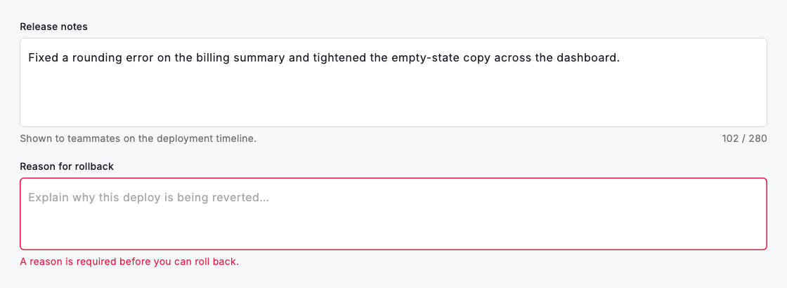
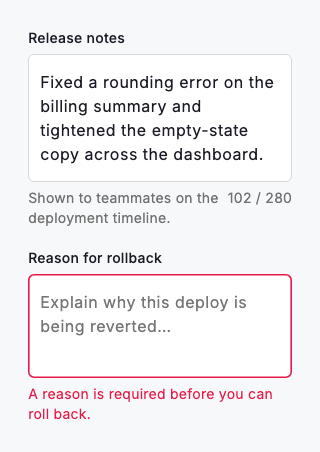

# Text area

The text area gives people room to write more than a line: notes, descriptions, feedback or a short message. `DsTextArea` pairs a persistent label with a filled, bordered box that starts at `minLines` and grows to `maxLines` before it begins to scroll, so the control expands with the content instead of forcing a cramped single line. A single caption slot beneath the field shows `helperText` in secondary text or, when validation fails, swaps to `errorText` in the danger colour and tints the border to match. Supply a `maxLength` and a live `count / max` counter appears at the trailing edge of that caption row. It gives writers a running budget and stops input at the limit.

Because helper and error captions share one row, they never appear at once: set `errorText` and it takes over from `helperText` until the value is valid again. Size the field to the job with `minLines` and `maxLines` (three to six lines suits most notes) and pass a `controller` when you need the character counter to track keystrokes or want to read the value back. Every colour, radius and type ramp is drawn from `DsTokens`, so the field re-skins with the active theme without any per-screen styling.



*Desktop (1120dp)*



*Small phone (320dp)*

## Guidelines

**Do**

- Use a text area whenever the expected answer runs past a single line, such as notes, descriptions or messages.
- Keep the label visible above the field and let hintText show the kind of detail you want rather than repeat the label.
- Use helperText to explain a constraint before someone writes, and errorText only after the value has been found invalid.
- Set maxLength when there is a real limit so the live counter guides writers and input stops cleanly at the cap.
- Choose minLines and maxLines to fit the task: enough room to start, a ceiling before the field scrolls.
- Pass a controller when the counter must track live input or you need to read the value back.

**Don't**

- Don't use a text area for short, structured values like an email or a code. Use a text field instead.
- Don't rely on the hint as the label; it vanishes the moment someone starts typing.
- Don't set both helperText and errorText expecting to see both. The error replaces the helper.
- Don't add a maxLength you won't enforce; the counter promises a limit the field will honour.

## Example

```dart
DsTextArea(
  label: 'Release notes',
  hintText: 'Summarise what changed in this version…',
  helperText: 'Shown to teammates on the deployment timeline.',
  minLines: 4,
  maxLines: 8,
  maxLength: 280,
  controller: _notesController,
  onChanged: (value) => setState(() => _notes = value),
)
```

## See also

- [Text fields](text-fields.md)
- [Form field group](form-field-group.md)
