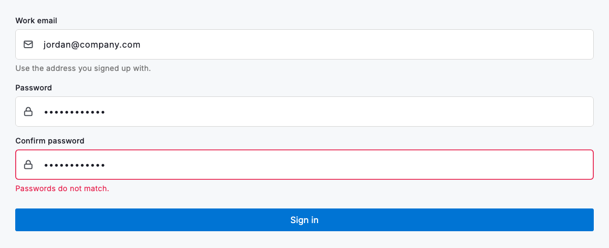
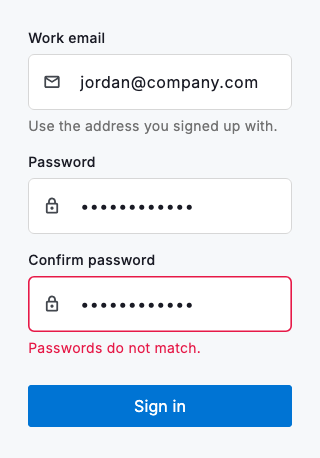

# Text fields

The text field is the workhorse of every form: a single- or multi-line input that pairs a persistent label with optional hint, helper and error text so people always know what to type and how they are doing. `DsTextField` handles the full lifecycle (an empty prompt, a filled value, guidance beneath the control and a clear validation error) while exposing `keyboardType`, `obscureText`, `prefixIcon` and `maxLines` so one component covers everything from a work email to a masked password to a multi-line note.

Keep the label visible at all times and let the `hintText` show an example of a valid entry rather than repeat the label. Use `helperText` to explain a format or constraint before the user acts, and switch to `errorText` only once a field has been touched and found invalid. The two never appear together. Set `keyboardType` to match the content so the right on-screen keyboard appears, and use `obscureText` for secrets.

Inside a `Form`, drive validation through the field rather than by hand: pass a `validator` and set `autovalidateMode: AutovalidateMode.onUserInteraction`, so the message appears only once someone has edited the field. A failing validator takes precedence over `errorText`, and either one hides `helperText`. Mark a genuinely optional field with `optional: true`, which appends a subdued Optional marker to its label, rather than annotating the required majority.



*Desktop (1280dp)*



*Small phone (320dp)*

## Guidelines

**Do**

- Always pair a field with a visible label so its purpose survives once a value is entered.
- Use helperText for guidance about format or constraints, and errorText for validation feedback.
- Set keyboardType to match the content (email, number, phone) so the right keyboard appears.
- Keep the placeholder or hint distinct from the label: show an example, not a repeat.

**Don't**

- Don't use the hint as the only label; it disappears the moment someone types.
- Don't show an error before the user has interacted with the field.
- Don't pack unrelated fields tightly together. Give each room and a clear boundary.

## Example

```dart
Column(
  crossAxisAlignment: CrossAxisAlignment.start,
  children: [
    DsTextField(
      label: 'Work email',
      hintText: 'you@company.com',
      helperText: 'Use the address you signed up with.',
      keyboardType: TextInputType.emailAddress,
      controller: _emailController,
      onChanged: (value) => setState(() => _email = value),
    ),
    const SizedBox(height: 16),
    DsTextField(
      label: 'Password',
      hintText: 'Enter your password',
      obscureText: true,
      controller: _passwordController,
      errorText: _showError ? 'Password must be at least 8 characters.' : null,
      onChanged: (value) => setState(() => _password = value),
    ),
    const SizedBox(height: 24),
    DsButton(
      label: 'Sign in',
      fullWidth: true,
      onPressed: () {},
    ),
  ],
)
```

## See also

- [Selection controls](selection-controls.md)
- [Select](select.md)
- [Sign in](sign-in.md)
